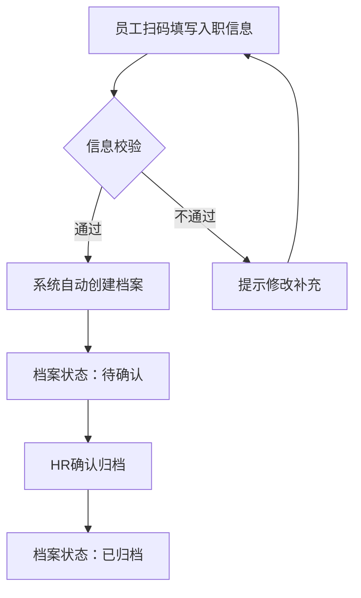
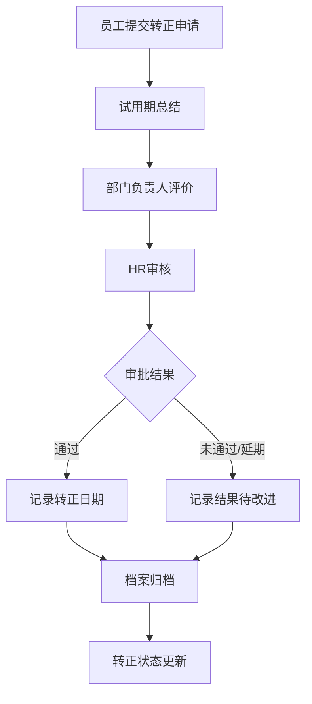
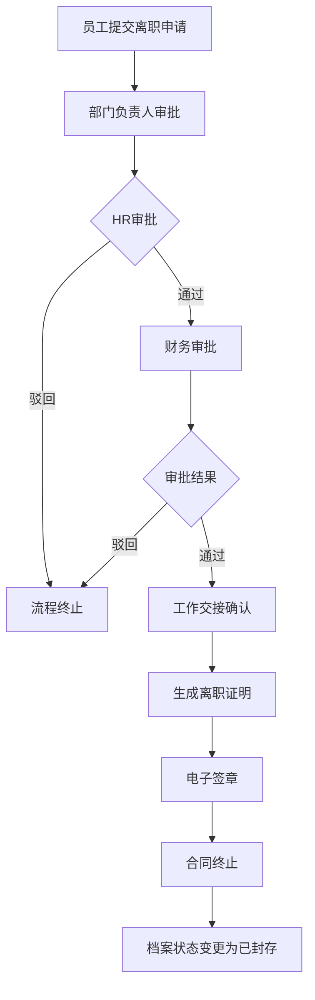
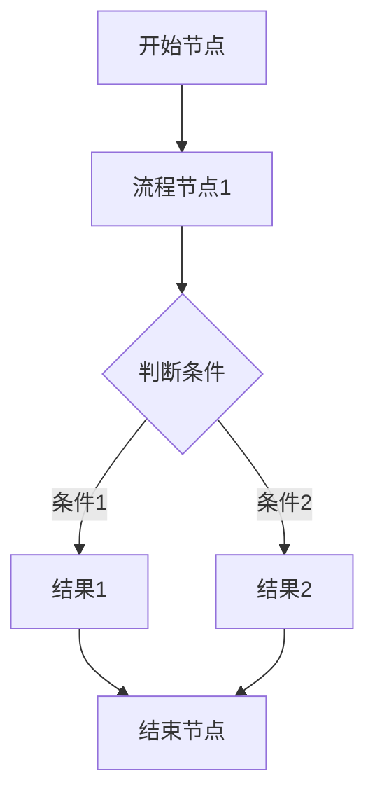

# PRD Writer Skill

**触发词**：`帮我写PRD` / `生成产品需求文档` / `写产品文档` / `生成产品原型` / `写一个产品文档` / `PRD`

**前置条件**：用户提供产品描述（功能想法、业务场景、项目背景等均可）

**输出**：完整PRD初稿（含中文ASCII组件树 + Mermaid流程图 + 边界场景 + 工时评估），等待用户确认后再写入飞书

##两种工作模式

| 模式 | 适用场景 | 问卷数量 |
|------|----------|----------|
| **完整PRD** | 全新产品/大型功能/系统性需求 | 14题 |
| **快速PRD** | 小需求迭代/字段增减/交互优化 | 3题 |

**切换规则**：用户说「快速PRD」「轻量PRD」「迭代PRD」时使用快速模式；其余默认完整模式。

---

##模式一：完整PRD

### Step 1: 需求确认问卷（必填）

在生成PRD之前，必须先与用户确认以下关键信息：

#### 1.1 产品基础信息

| # | 问题 | 选项/说明 |
|---|------|----------|
| 1 | 产品/项目名称 | 用户提供 |
| 2 | 目标企业规模 | 小型/中型/大型 |
| 3 | 核心用户角色 | 系统管理员/HR/部门负责人/普通员工/财务 等 |
| 4 | 使用终端 | PC Web / 移动端（H5/小程序/App）/ 两者都要 |

#### 1.2 菜单结构确认（重要）

| # | 交互结构选项 | 说明 |
|---|-------------|------|
| A | **单层列表→详情结构** | 一级菜单进入列表页，点击进入详情页（本次使用） |
| B | 多级菜单结构 | 一级→二级→三级菜单页 |
| C | Tab切换结构 | 详情页内Tab切换子模块 |

**推荐**：优先选择「单层列表→详情结构」，详情页内通过Tab或按钮切换展示子模块信息。

#### 1.3 页面交互确认

| # | 问题 | 选项 |
|---|------|------|
| 5 | 详情页子模块展示方式 | [ ] Tab切换 / [ ] 点击按钮刷新页面 |
| 6 | 是否需要「新建」入口 | [ ] 需要 / [ ] 不需要 |
| 7 | 页面操作类型 | [ ] 只读查看 / [ ] 可编辑 / [ ] 可导出 |

#### 1.4 权限配置确认

| # | 问题 | 说明 |
|---|------|------|
| 8 | 是否需要权限模块 | [ ] 需要 / [ ] 不需要 |
| 9 | 普通员工默认权限 | [ ] 全部可看 / [ ] 部分可看（需配置） |
| 10 | 是否有数据敏感字段 | [ ] 有（如薪资、身份证号）/ [ ] 无 |

#### 1.5 业务流程确认

| # | 问题 | 选项 |
|---|------|------|
| 11 | 是否需要流程图 | [ ] 需要Mermaid流程图 / [ ] 不需要 |
| 12 | 流程类型（如需要） | [ ] 入职流程 / [ ] 审批流程 / [ ] 离职流程 / [ ] 自定义 |

#### 1.6 版本规划确认

| # | 问题 | 说明 |
|---|------|------|
| 13 | 是否有分期上线计划 | [ ] 有（需提供版本规划）/ [ ] 无（单版本） |
| 14 | MVP优先模块 | 用户提供优先级顺序 |

---

**问卷使用方式**：
1. 将问卷发送给用户
2. 用户填写完毕后，基于用户反馈生成PRD
3. 如果用户未填写某些项，基于最佳实践给出默认值，并在PRD中注明

---

## 模式二：快速PRD

适用于小需求迭代，简化流程，快速输出。

### 快速问卷（3题）

| # | 问题 | 说明 |
|---|------|------|
| 1 | 需求描述 | 简洁描述要做什么（一句话） |
| 2 | 影响范围 | [ ] 列表页 / [ ] 详情页 / [ ] 新建表单 / [ ] 导出 / [ ] 审批流程 |
| 3 | 优先级 | P0（紧急）/ P1（重要）/ P2（优化） |

### 快速PRD输出格式

```
#快速PRD：需求名称

## 概述
[一句话描述需求背景和目标]

## 改动范围
|位置 | 改动内容 | 优先级 |
|------|----------|--------|
| 档案列表页 | 新增「在职状态」筛选 | P1 |
| 档案详情页 | 新增「紧急联系人」字段 | P1 |

## 页面原型
[中文ASCII组件树，仅描述改动点]

## 边界场景
[空状态/加载失败/权限不足等]

## 工时评估
| 功能点 | 工时(人天) | 技术风险 | 备注 |
|--------|------------|----------|------|
| 在职状态筛选 | 0.5 | 低 | 复用现有筛选组件 |
```

---

## Product Category Detection

Automatically identify product category from user description:

| Category Keywords | Product Type |
|-------------------|--------------|
| 用户端、App、小程序、社交、电商、直播 | C端产品 |
| 后台、系统管理、SaaS、企业、内部系统 | B端产品 |
| 数据看板、图表、分析、报表、BI | 数据产品 |
| AI功能、智能、算法、推荐、NLU | AI/算法产品 |
| 模糊/未明确 | 通用产品 |

---

## Usage Example

**User Input (完整PRD):**
> "帮我写一个社交App的PRD，主要功能是附近的人聊天、AI匹配、阅后即焚"

**Skill Response:**
1. 发送需求确认问卷
2. 用户确认后，识别为 C端产品
3. 生成完整PRD（8个章节 + Mermaid流程图 + 边界场景 + 工时评估）
4. 输出示例：

```markdown
# 产品名称：附近约玩社交App

## 1. 产品概述
[表格：产品背景、目标、范围...]

## 2. 修订记录
[记录PRD每次修订的内容]

## 3. 用户分析
[用户画像：18-25岁年轻用户...]
[用户旅程：发现→匹配→聊天→关系]
[需求痛点：P0-真实性、 P1-匹配效率...]

## 4. 需求详述
### 功能列表
[脑图结构]

### 页面交互流程
[描述页面之间的跳转关系]

### 原型描述（示例页面）
页面ID: P001
页面名称: 发现页
组件树:
根节点
├── 顶部导航栏
│   ├── 搜索图标
│   └── 消息图标
├── 附近用户卡片列表
│   ├── 用户卡片
│   │   ├── 头像（大图）
│   │   ├── 昵称
│   │   ├── 距离标签
│   │   └── AI匹配度Badge
│   └── ...（更多卡片）
└── 底部TabBar
    ├── 发现
    ├── 消息
    └── 我的

### 边界场景
| 场景 | 页面表现 | 用户提示 | 处理逻辑 |
|------|----------|----------|----------|
| 无附近用户 | 空状态插画+文案 | "暂无附近用户" | 推荐修改定位 |
| 网络加载失败 | 骨架屏→错误提示 | "加载失败，点击重试" | 重试按钮 |
| 匹配人数为0 | 空状态 | "暂无匹配结果" | 调整匹配条件 |

### 业务流程图
[Mermaid流程图]

### 工时评估
| 功能点 | 工时(人天) | 技术风险 | 第三方依赖 | 改造成本 |
|--------|------------|----------|------------|----------|
| 发现页用户卡片 | 2 | 低 | 定位SDK | 低 |
| AI匹配算法 | 5 | 中 | 第三方AI | 高 |
```

**Next Step:** 等待用户确认后询问"是否需要写入飞书文档？"

---

## When NOT to Use

| ❌ 不适合场景 | 说明 |
|--------------|------|
| 技术方案设计 | PRD聚焦"做什么"，不是"怎么做" |
| UI设计稿 | 用原型工具而非PRD描述UI |
| 项目计划/排期 | 用甘特图/项目管理工具 |
| 纯市场分析 | 用竞品分析文档(MRD) |
| 已上线产品的迭代需求（用快速PRD） | 用需求列表/迭代文档 |

---

## PRD Document Structure

### 1. 产品概述

| Section | Description |
|---------|-------------|
| 产品名称 | 项目/产品名称 |
| 需求背景 | 业务场景、用户需求、市场机会 |
| 业务问题 | 核心痛点（P0/P1/P2）+ 影响分析 |
| 本期产品目标 | 目标维度 + 衡量指标（SMART） |
| 本期菜单清单总览 | 功能点列表（含优先级） |
| 名词定义 | 关键术语解释 |

### 2. 修订记录

记录PRD每次重要修订，便于追踪变更历史：

| 日期 | 版本 | 修订内容 |修订人 |
|------|------|----------|--------|
| 2026-06-08 | v1.0 | 初版生成 | - |
| 2026-06-08 | v1.1 | 优化菜单结构、权限矩阵 | - |

### 3. 用户分析

| Section | Description |
|---------|-------------|
| 用户角色 | 用户群体特征、角色卡片 + 默认权限说明 |
| 用户旅程 | 用户使用路径、关键触点 |
| 需求痛点 | 核心痛点、优先级(P0/P1/P2) |

### 4. 需求详述

| Section | Description |
|---------|-------------|
| 功能总览 | 核心功能清单、脑图结构 |
| 页面交互流程 | 页面跳转关系 |
| 模块详细说明 | 各功能模块字段说明（含必填 +详细解释） |
| 业务流程图 | Mermaid流程图 |
| 原型描述 | 页面说明、中文ASCII组件树 |
| 权限矩阵 | 角色×功能权限表（含默认权限标识） |
| **边界场景** | **空状态、加载失败、权限不足等边界情况** |
| **工时评估** | **功能点工时、技术风险、第三方依赖、改造成本** |

### 5. 非功能需求

| Section | Description |
|---------|-------------|
| 性能需求 | 响应时间、并发量 |
| 安全需求 | 权限设计、数据安全、脱敏展示 |
| 集成需求 | 第三方系统集成 |
| 数据导入导出 | Excel导入导出说明 |

### 6. 项目排期

| Section | Description |
|---------|-------------|
| 版本规划 | MVP版本 + 迭代计划（含模块依赖关系） |
| 里程碑 | 关键节点、时间规划 |
| 依赖关系 | 外部依赖、内部依赖 |

### 7. 附录

| Section | Description |
|---------|-------------|
| 术语表 | 行业术语解释 |
| FAQ | 常见问题解答 |

---

## Page Prototype Description Format

### 格式一：中文ASCII组件树

**Standard:** Chinese ASCII component tree

**Structure per page:**
```
页面ID: [page_id]
页面名称: [page_name]
页面描述: [page_description]

组件树:
根节点
├── 组件A
│   ├── 子组件A1
│   │   └── 叶子组件A1a
│   └── 子组件A2
│       └── 叶子组件A2a
├── 组件B
│   └── (同上)
```

**Rules:**
1. Every component uses Chinese names (e.g., "顶部导航栏" not "Header")
2. Leaf components are at the lowest nesting level
3. Each page is self-contained with clear ID and description
4. Designed for OpenCLAW to parse and generate HTML prototypes

### 格式二：页面交互流程

描述页面之间的跳转关系：

```
页面交互流程:
列表页 --点击姓名/操作--> 详情页
详情页 --Tab切换--> [模块A|模块B|模块C|模块D]
详情页 --操作按钮--> [导出|打印|编辑]
```

### 格式三：Mermaid业务流程图

**内置流程图模板：**

#### 入职流程


#### 转正流程


#### 离职流程


#### 自定义流程


---

## 边界场景格式

每个功能模块必须补充边界场景：

| 场景 | 页面表现 | 用户提示 | 处理逻辑 |
|------|----------|----------|----------|
| **列表为空** | 空状态插画+文案 | "暂无档案记录" | 引导新建/导入 |
| **网络加载失败** | 骨架屏→错误提示 | "加载失败，点击重试" | 重试按钮 |
| **档案不存在** | 404页面 | "档案不存在或已删除" | 返回列表/刷新 |
| **无权限查看** | 灰色遮罩/部分隐藏 | "您暂无查看权限" | 联系管理员提示 |
| **数据加载中** | 骨架屏/loading动画 | 无需提示 | 正常等待 |
| **搜索无结果** | 空状态+搜索建议 | "未找到匹配结果" | 调整关键词提示 |
| **操作频率限制** | 按钮置灰 | "操作过于频繁，请稍后" | 倒计时恢复 |
| **导出数据量大** | 进度条/异步通知 | "正在导出，请稍候" | 邮件/消息通知 |

**说明**：
- 边界场景按优先级覆盖：空状态 > 加载失败 >权限不足 > 其他
- 每个列表页、详情页、操作按钮必须标注至少1个边界场景
- 处理逻辑需明确：前端处理还是后端处理

---

## 字段说明格式

每个功能模块的字段表必须包含以下列：

| 字段名 | 类型 | 必填 | 说明 | 详细解释 |
|--------|------|------|------|----------|
| 姓名 | 文本 | ✓ | 员工姓名 | 用于档案身份识别，也是系统登录的名称展示 |
| 手机号 | 文本 | ✓ | 联系方式 | 用于系统登录及通讯；需唯一性校验，格式为11位手机号 |
| 身份证号 | 文本 | ✓ | 身份标识 | 用于实名认证及法律合规；需格式校验，18位或15位 |

**说明**：
- **类型**：文本/数字/日期/单选/多选/关联/文件 等
- **必填**：✓ 表示必填，- 表示选填
- **说明**：简短说明字段用途
- **详细解释**：字段的业务含义、校验规则、关联说明等

---

## 权限矩阵格式

### 支持「默认权限」概念

| 角色 | 功能A | 功能B | 功能C | 功能D |
|------|------|------|------|------|
| 系统管理员 | 全部 | ✓ | ✓ | ✓ |
| HR 管理员 | 全部 | ✓ | ✓ | ✗ |
| 部门负责人 | 本部门 | ✓ | ✗ | ✗ |
| 普通员工 | 仅本人 | ✓（默认） | ✗（需配置） | ✗（需配置） |
| 财务人员 | ✗ | ✗ | 全部 | ✓ |

**说明**：
- ✓ 表示有权限
- ✗ 表示无权限
- ✓（默认）表示默认开放，管理员可撤销
- ✗（需配置）表示默认无权限，需管理员配置后开通

---

## 工时评估格式

每个功能点必须评估工时和风险：

| 功能点 | 工时(人天) | 技术风险 | 第三方依赖 | 改造成本 |
|--------|------------|----------|------------|----------|
| 档案列表+筛选 | 1 | 低 | 无 | 低 |
| 详情页Tab切换 | 0.5 | 低 | 无 | 低 |
| Excel导出 | 2 | 中 | Excel库 | 中 |
| 电子签章集成 | 5 | 高 | 第三方签章SDK | 高 |

**说明**：
- **工时**：按人天计算，0.5=半天
- **技术风险**：低/中/高（涉及复杂算法/第三方集成/性能瓶颈）
- **第三方依赖**：无/有（如有需注明具体SDK/服务）
- **改造成本**：低/中/高（后续迭代改动的难度）

---

## 版本规划格式

| 版本 | 前置依赖 | 模块 | 功能范围 | 预计周期 |
|------|----------|------|----------|----------|
| **v1.0** | 无 | 人员档案 | 入职建档、转正记录、异动记录、离职记录 | 6 周 |
| **v1.1** | v1.0 | 薪资档案 | 工资条生成、薪资计算、历史查看 | 6 周 |
| **v1.2** | v1.1 | 集成优化 | 钉钉对接、权限体系优化 | 4 周 |

**说明**：
- **前置依赖**：该版本上线前需要完成的依赖版本
- 便于识别模块之间的依赖关系，合理安排迭代顺序

---

## Output Format

**Style:** Structured template with tables + Chinese ASCII component trees + Mermaid flowcharts

**Length:** Comprehensive but concise per section

**Tone:** Professional, objective, data-driven

**Prototype Format:** Chinese component trees for each page

---

## Decision Rules

1. **Always confirm before Feishu write** — Never auto-write
2. **Auto-detect product category** — No manual selection needed
3. **Full module coverage** — Always include all sections
4. **Structured over narrative** — Tables > paragraphs
5. **Chinese component names** — All component trees use Chinese names
6. **需求确认问卷优先** — 必须先完成Step 1再生成PRD
7. **字段必须有详细解释** — 每个字段列必须包含详细说明
8. **边界场景必填** — 每个功能模块必须覆盖至少1个边界场景
9. **工时评估必填** — 每个功能点必须评估工时和风险

---

## Common Mistakes

| Mistake | Prevention |
|---------|-------------|
| Skipping user analysis section | Always include all sections |
| Writing before user confirms | Require explicit confirmation |
| Too vague on metrics | Specify concrete numbers |
| Missing version planning | Always include version milestones |
| Using English component names | Use Chinese names for OpenCLAW compatibility |
| Missing field explanations | Every field must have detailed explanation |
| No page flow description | Always include interaction flow between pages |
| Permission matrix without default concept | Use ✓（默认）/✗（需配置）notation |
| Missing boundary scenarios | Every module must cover at least 1 boundary scenario |
| Missing work hour estimation | Every function point must have time/risk assessment |

---

## Quick Reference

| 项目 | 内容 |
|------|------|
| **触发词（完整PRD）** | 帮我写PRD / 生成产品需求文档 / 写产品文档 / PRD |
| **触发词（快速PRD）** | 快速PRD / 轻量PRD / 迭代PRD |
| **必需信息** | 用户提供的产品描述 + 需求确认问卷填写 |
| **输出** | 完整PRD初稿（含中文ASCII组件树 + Mermaid流程图 + 边界场景 + 工时评估） |
| **下一步** | 等待用户确认后，询问"是否写入飞书？" |

---

## Production Checklist

PRD输出前自检：

```
✅ 需求确认问卷已填写（完整PRD 14题 / 快速PRD 3题）
✅ 产品类别已识别（C端/B端/数据/AI/通用）
✅ 产品概述包含：需求背景、业务问题、本期产品目标、菜单清单总览
✅ 包含修订记录章节
✅ 每个功能模块有明确的P0/P1/P2优先级
✅ 页面交互流程已描述（列表→详情→Tab等）
✅ 原型描述使用中文ASCII组件树
✅ 每个字段有必填标识和详细解释
✅ 权限矩阵包含默认权限标识（✓（默认）/✗（需配置））
✅ 业务流程使用Mermaid流程图展示
✅ 每个功能模块有边界场景覆盖
✅ 每个功能点有工时评估和技术风险
✅ 版本规划包含模块依赖关系
✅ MVP版本有明确里程碑
✅ 用户已确认后再写入飞书
```

---

## Feishu Write Integration

### 写入飞书文档

When user confirms and wants to write to Feishu:
1. Use `lark-cli docs +create --api-version v2` to create new document
2. Use markdown format for document content
3. Return the document URL to user
4. Update memory with document link

**命令示例**：
```bash
lark-cli docs +create --api-version v2 \
  --title "产品名称PRD" \
  --content "$(cat PRD.md)" \
  --as bot
```

### 更新飞书文档

**正确用法**（经验证）：
```bash
lark-cli docs +update \
  --api-version v2 \
  --doc "文档ID" \
  --as bot \
  --content "$(cat PRD.md)" \
  --mode overwrite \
  --command "overwrite"
```

**关键参数说明**：
- `--content`：要写入的内容（不能用 `--markdown`）
- `--mode overwrite`：覆盖模式
- `--command "overwrite"`：必须指定，否则报错

**权限要求**：需要 bot 身份，且 bot 对文档有编辑权限

---

## Prototype-to-HTML Workflow

This skill generates the PRD. For subsequent HTML prototype generation:
1. OpenCLAW reads the Chinese ASCII component trees
2. OpenCLAW generates HTML with proper component structure
3. The component tree structure maps directly to HTML DOM hierarchy

---

## Changelog

| 版本 | 日期 | 改进内容 |
|:---|:---|:---|
| v1.0.0 | 2026-05-18 | 初版（基础PRD结构 + 中文ASCII组件树）|
| v1.1.0 | 2026-05-23 | 优化：frontmatter扩展、触发词前置、使用示例、反面场景、Production Checklist |
| v2.0.0 | 2026-06-08 | **重大升级**：新增需求确认问卷、页面交互流程、Mermaid流程图模板、字段详细解释、权限默认概念、版本依赖关系、修订记录章节、飞书更新问题说明 |
| **v2.1.0** | 2026-06-10 | **新增双模式**（完整PRD+快速PRD）、**边界场景模板**、**工时评估表**、**删除埋点需求模块** |