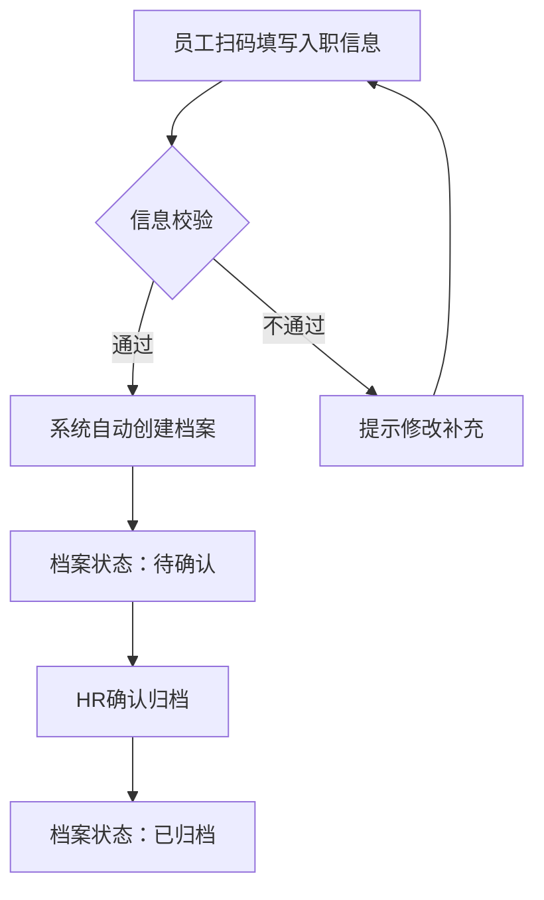
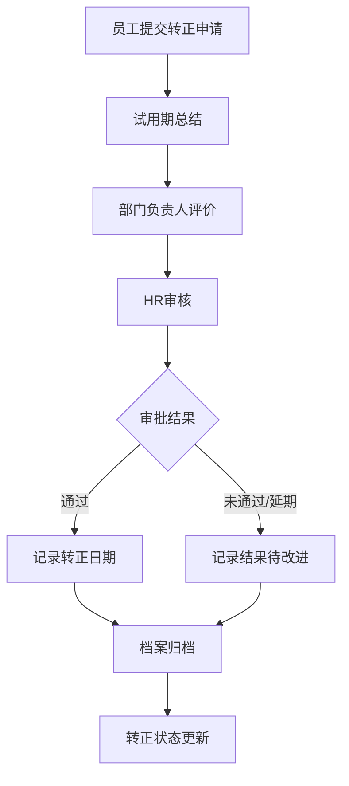
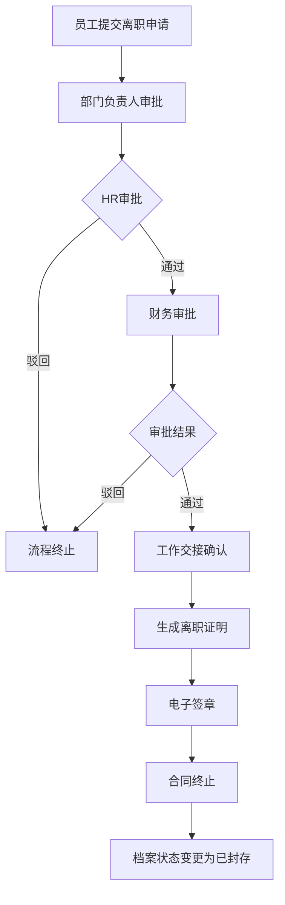
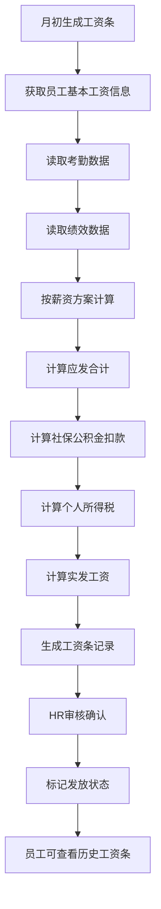

# 产品名称：华翔人员档案管理系统

## 1. 产品概述

### 1.1 基本信息

| 项目 | 内容 |
|------|------|
| **产品名称** | 华翔人员档案管理系统 |
| **产品定位** | 企业人力资源档案管理模块（档案只读，操作归口至对应业务模块） |
| **目标企业** | 华翔集团（大型企业） |
| **使用终端** | PC Web端 + 钉钉小程序（预留） |
| **产品版本** | v1.0（人员档案）→ v1.1（薪资档案） |

---

### 1.2 需求背景

随着华翔集团业务规模持续扩大，员工数量逐年增长，传统的人员档案管理方式已难以满足企业数字化转型的需求。当前人力资源管理面临档案信息分散、查询效率低、数据安全性不足等问题，亟需通过系统化手段实现人员档案的集中管理、安全存储与高效查阅。

---

### 1.3 业务问题

| 优先级 | 问题描述 | 影响分析 |
|--------|----------|----------|
| P0 | 人员档案以纸质或Excel形式散落存储，缺乏统一管理平台 | HR日常工作重复性高，查找档案耗时费力 |
| P0 | 薪资数据涉及隐私，权限管控不精细 | 数据泄露风险高，违反数据合规要求 |
| P1 | 员工转正、异动、离职等流程审批结果需手工登记归档 | 流程与档案分离，容易造成档案缺失或错误 |
| P1 | 离职证明等文件需线下打印签章，效率低下 | 员工体验差，HR工作负担重 |
| P2 | 钉钉等办公平台已深度使用，但档案系统尚未对接 | 信息孤岛，数据无法互通 |

---

### 1.4 本期产品目标

| 目标维度 | 目标描述 | 衡量指标 |
|----------|----------|----------|
| **档案数字化** | 实现员工从入职到离职全生命周期档案电子化存储 | 档案完整率 ≥ 95% |
| **权限精细化** | 建立基于角色的数据访问控制体系 | 权限配置合规率 = 100% |
| **流程可追溯** | 员工转正、异动、离职等审批结果自动归档 | 转正记录覆盖率 ≥ 98% |
| **薪资档案化** | 员工每月薪资明细规范存档，支持历史查询 | 薪资档案及时率 ≥ 90% |

---

### 1.5 本期菜单清单总览

| 序号 | 一级菜单 | 功能说明 | 优先级 |
|------|----------|----------|--------|
| 1 | 人员档案 | 入口：档案列表 → 点击个人进入详情 → Tab切换查看子模块信息 | P0 |
| 2 | 薪资档案 | 入口：工资条列表 → 点击个人进入详情 → 查看薪资明细 | P0 |
| 3 | 系统管理 | 权限配置（仅管理员） | P0 |

---

### 1.6 名词定义

| 术语 | 定义 |
|------|------|
| **人员档案** | 员工从入职到离职全生命周期的基础信息记录 |
| **薪资档案** | 员工每月薪资结构与发放记录，只读存档 |
| **档案模块** | 本模块定位为"只读档案查看"，不包含业务操作（操作在对应业务模块） |
| **转正记录** | 员工试用期结束后的评价与审批结果存档 |
| **调岗晋升记录** | 员工岗位变动历史存档 |
| **工资条** | 员工单月薪资明细记录 |
| **电子签章** | 具有法律效力的电子签名/签章 |

---

## 2. 用户分析

### 2.1 用户角色

| 角色 | 说明 | 档案查看权限 |
|------|------|-------------|
| **系统管理员** | 负责系统权限配置、数据架构维护 | 全量数据 |
| **HR管理员** | 负责人员档案维护、薪资档案管理 | 全量数据 |
| **部门负责人** | 查看本部门员工档案 | 本部门员工 |
| **普通员工** | 查看本人档案 | 仅本人（默认可看入职信息+异动记录） |
| **财务人员** | 查看薪资相关档案 | 薪资档案全量 |

### 2.2 用户旅程

```
【入职】员工扫码填写 → 系统自动建档 → HR 确认归档
    ↓
【转正】员工提交申请 → 部门负责人评价 → HR 审核 → 记录归档
    ↓
【在职】调岗/晋升 → 审批通过 → 异动记录归档（薪资可联动查看）
    ↓
【离职】员工申请 → 多级审批 → 工作交接 → 离职证明签章 → 档案封存
```

### 2.3 需求痛点

| 优先级 | 痛点 | 解决方案 |
|--------|------|----------|
| P0 | 大型企业员工档案散落，难以统一查阅 | 集中建档，全生命周期存档 |
| P0 | 薪资数据敏感，需严格权限隔离 | 角色权限体系，数据分级查看 |
| P1 | 离职证明电子化需求 | 集成电子签章，留存证明文件 |
| P1 | 薪资结构配置灵活，公式各异 | 可配置薪资公式引擎 |
| P2 | 与钉钉等外部系统集成 | API预留，后期对接 |

---

## 3. 需求详述

### 3.1 功能总览

```
人员档案管理系统
├── 【模块一】人员档案管理
│   ├── 档案列表（主入口）
│   ├── 档案详情（Tab切换）
│   │   ├── 入职信息
│   │   ├── 转正记录
│   │   ├── 异动记录
│   │   └── 离职记录
│   └── 新建档案（HR手动创建）
│
└── 【模块二】薪资档案管理
    ├── 工资条列表（主入口）
    └── 工资条详情
```

---

### 3.2 模块一：人员档案管理

#### 3.2.1 档案列表页

| 项目 | 内容 |
|------|------|
| **功能描述** | 展示全员档案列表，支持筛选、搜索、导出 |
| **进入方式** | 点击一级菜单「人员档案」直接进入 |

**字段列表**：

| 字段名 | 类型 | 必填 | 说明 |
|--------|------|------|------|
| 工号 | 文本 | - | 系统自动生成，唯一编号 |
| 姓名 | 文本 | ✓ | 员工真实姓名 |
|性别 | 单选 | ✓ | 男/女 |
| 所属部门 | 下拉选择 | ✓ | 关联组织架构 |
| 岗位 | 下拉选择 | ✓ | 关联岗位字典 |
| 入职日期 | 日期 | ✓ | 员工正式入职日期 |
| 档案状态 | 单选 | ✓ | 活跃/已封存 |

**交互说明**：
- 点击列表中的「姓名」进入该员工的档案详情页
- 支持按部门、在职状态、入职日期范围筛选
- 支持按姓名/工号搜索
- 支持Excel导出（权限控制）

#### 3.2.2 档案详情页

| 项目 | 内容 |
|------|------|
| **功能描述** | 展示单个员工全生命周期档案，通过Tab切换查看各子模块信息，支持HR/管理员直接编辑 |
| **进入方式** | 点击档案列表中的员工姓名 |
| **编辑权限** | HR管理员、系统管理员 |

**Tab标签页**：

| Tab名称 | 展示内容 | 可编辑 |
|--------|----------|--------|
| 入职信息 | 员工扫码填写的入职原始数据（员工类型、招聘来源、试用期薪资、转正薪资、手写签名） | ✓ |
| 基本信息 | 员工个人详细信息（婚姻状况、身份证信息、社保公积金、地址、血型等） | ✓ |
| 个人材料 | 员工证件材料（身份证、学历证书、银行卡照片等，支持在线预览/下载） | ✓ |
| 转正记录 | 转正审批结果（试用期总结、部门评价、HR意见、转正日期、状态） | - |
| 异动记录 | 调岗/晋升/降职历史（原部门→新部门、原岗位→新岗位、原职级→新职级、生效日期、异动原因） | - |
| 离职记录 | 离职办理全流程节点（申请日期、各级审批、工作交接、离职证明） | - |
| 审批记录 | 各流程节点审批记录（转正/晋升/调岗/离职/调薪等，含审批人、审批时间、审批意见） | - |
| 合同记录 | 员工劳动合同全生命周期（合同签订/续签/变更/终止，支持电子签章） | - |

**页面编辑交互**：
- 每个Tab页内容区右上角显示「编辑」按钮（仅HR/管理员可见）
- 点击「编辑」按钮后，字段切换为输入框/下拉框状态
- 页面显示「保存」「取消」按钮
- 保存后数据直接生效，同时同步更新至对应业务模块（入职办理/转正申请/异动申请）
- 所有编辑操作记录操作日志

**字段说明**：

**入职信息Tab字段**：

| 字段名 | 类型 | 必填 | 说明 |
|--------|------|------|------|
| 姓名 | 文本 | ✓ | 员工真实姓名，用于档案身份识别 |
| 手机号 | 文本 | ✓ | 员工联系方式，用于系统登录及通讯；需唯一性校验 |
| 身份证号 | 文本 | ✓ | 员工身份标识，用于实名认证及法律合规；需格式校验 |
| 性别 | 单选 | ✓ | 男/女，用于人事统计 |
| 出生日期 | 日期 | ✓ | 身份证读取或手动填写，用于年龄统计及生日福利 |
| 学历 | 单选 | - | 高中/大专/本科/硕士/博士/本科在读，用于人才结构分析 |
| 籍贯 | 文本 | - | 员工祖籍，用于地域分布统计 |
| 紧急联系人 | 文本 | - | 格式：姓名+关系+电话，用于紧急情况联系 |
| 银行卡号 | 文本 | - | 格式：开户行+卡号，用于工资发放 |
| 所属部门 | 下拉选择 | ✓ | 关联组织架构，用于部门归属及权限控制 |
| 岗位 | 下拉选择 | ✓ | 关联岗位字典，用于职级及薪资核算 |
| 职级 | 下拉选择 | - | 如：初级/中级/高级/资深/专家/总监等 |
| 入职日期 | 日期 | ✓ | 员工正式入职日期，用于工龄计算及合同管理 |
| 试用期时长 | 数字 | - | 单位：月，用于试用期管理及转正提醒 |
| 合同类型 | 单选 | - | 全职/兼职/实习，用于合同管理及福利差异 |
| 合同期限 | 日期区间 | - | 起始日期至截止日期，用于合同到期提醒 |
| 员工类型 | 单选 | - | 校招生/社招生/内推/猎头/实习生/外包 |
| 招聘来源 | 单选 | - | BOSS直聘/智联招聘/前程无忧/猎聘/内推/校招/其他 |
| 试用期薪资 | 数字 | - | 员工试用期期间的月薪 |
| 转正薪资 | 数字 | - | 员工转正后的月薪 |
| 电子签名 | 图片 | - | 员工手写签名，用于电子签章 |

**基本信息Tab字段**：

| 字段名 | 类型 | 必填 | 说明 |
|--------|------|------|------|
| 婚姻状况 | 单选 | - | 未婚/已婚/离异/丧偶 |
| 身份证开始日期 | 日期 | - | 身份证有效期开始时间 |
| 身份证截止日期 | 日期 | - | 身份证有效期截止时间 |
| 首次参加工作时间 | 日期 | - | 员工首次参加工作的时间，用于工龄计算 |
| 工龄 | 计算字段 | - | 系统自动计算：当前日期-首参时间 |
| 户籍类型 | 单选 | - | 农业/非农业/其他 |
| 住址 | 文本 | - | 员工当前居住地址 |
| 政治面貌 | 单选 | - | 群众/共青团员/中共党员/中共预备党员/民革会员/民盟盟员/其他 |
| 个人社保账号 | 文本 | - | 员工社保账号 |
| 个人公积金账号 | 文本 | - | 员工公积金账号 |
| 户口所在地 | 文本 | - | 员工户籍所在地 |
| 是否退役军人 | 单选 | - | 是/否 |
| 身高 | 数字 | - | 单位cm |
| 体重 | 数字 | - | 单位kg |
| 血型 | 单选 | - | A型/B型/AB型/O型/其他 |
| 是否有亲属关系 | 单选 | - | 是/否 |
| 亲属姓名 | 文本 | - | 亲属姓名 |
| 亲属所在部门 | 文本 | - | 亲属所在部门 |
| 毕业学校 | 文本 | - | 员工毕业院校 |
| 毕业时间 | 日期 | - | 员工毕业时间 |
| 所学专业 | 文本 | - | 员工大学专业 |
| 银行名称 | 文本 | - | 工资卡开户银行 |
| 开户行 | 文本 | - | 具体支行名称 |
| 银行卡号 | 文本 | - | 银行卡号，支持隐藏/显示切换 |

**个人材料Tab字段**：

| 字段名 | 类型 | 必填 | 说明 |
|--------|------|------|------|
| 身份证（正） | 图片 | - | 支持预览/下载 |
| 身份证（反） | 图片 | - | 支持预览/下载 |
| 学历证书 | 图片 | - | 支持预览/下载 |
| 学位证书 | 图片 | - | 支持预览/下载 |
| 前公司离职证明 | 图片 | - | 支持预览/下载 |
| 员工照片 | 图片 | - | 支持预览/下载 |
| 银行卡照片 | 图片 | - | 支持预览/下载 |
| 人员技能证书 | 图片 | - | 职业技能等级证书（如焊工、电工、钳工等），支持预览/下载 |
| 退役军人证 | 图片 | - | 退役军人优待证或退伍证，支持预览/下载 |
| 残疾人证 | 图片 | - | 中国残疾人联合会核发的残疾证，支持预览/下载 |
| 相关从业资格证 | 图片 | - | 行业准入类资格证书（如教师资格证、医师执业证等），支持预览/下载 |

**转正记录Tab字段**：

| 字段名 | 类型 | 必填 | 说明 |
|--------|------|------|------|
| 申请日期 | 日期 | ✓ | 员工提交转正申请日期 |
| 试用期总结 | 多文本 | - | 员工对试用期工作的总结汇报 |
| 部门负责人评价 | 多文本 | - | 直属上级对员工试用期表现的评价意见 |
| HR审核意见 | 多文本 | - | HR对员工转正的综合审核意见 |
| 转正日期 | 日期 | ✓ | 正式转正日期，用于合同变更及薪资调整 |
| 转正状态 | 单选 | ✓ | 通过/未通过/延期，用于转正结果记录 |
| 附件 | 文件 | - | 相关评价附件，如考核表等证明材料 |

**异动记录Tab字段**：

| 字段名 | 类型 | 必填 | 说明 |
|--------|------|------|------|
| 异动日期 | 日期 | ✓ | 异动生效日期 |
| 生效日期 | 日期 | ✓ | 异动正式生效的具体日期 |
| 异动类型 | 单选 | ✓ | 调岗/晋升/降职，用于异动类型区分 |
| 原部门 | 关联 | ✓ | 异动前所属部门 |
| 新部门 | 关联 | ✓ | 异动后所属部门 |
| 原岗位 | 关联 | ✓ | 异动前岗位 |
| 新岗位 | 关联 | ✓ | 异动后岗位 |
| 原职级 | 下拉选择 | - | 异动前职级 |
| 新职级 | 下拉选择 | - | 异动后职级 |
| 异动原因 | 多文本 | - | 异动发生的具体原因说明 |
| 审批结论 | 文本 | ✓ | 审批结果的简要摘要 |

**离职记录Tab字段**：

| 字段名 | 类型 | 必填 | 说明 |
|--------|------|------|------|
| 离职日期 | 日期 | ✓ | 正式离职日期 |
| 离职类型 | 单选 | ✓ | 主动离职/被动离职/退休 |
| 最后工作日 | 日期 | - | 员工最后在岗日期 |
| 提交申请日期 | 日期 | ✓ | 员工提交离职申请的日期 |
| 部门负责人审批 | 单选 | ✓ | 通过/驳回/待审批，记录部门审批结果 |
| 部门负责人审批时间 | 日期 | - | 部门负责人审批的具体时间 |
| HR审批 | 单选 | ✓ | 通过/驳回/待审批，记录HR审批结果 |
| HR审批时间 | 日期 | - | HR审批的具体时间 |
| 财务审批 | 单选 | ✓ | 通过/驳回/待审批，记录财务审批结果 |
| 财务审批时间 | 日期 | - | 财务审批的具体时间 |
| 工作交接人 | 文本 | - | 接收工作交接的员工姓名 |
| 交接日期 | 日期 | - | 完成交接的具体日期 |
| 工作交接确认 | 多文本 | - | 交接事项清单，含工作进度、资产归还等确认项 |
| 离职原因 | 文本 | - | 员工离职的具体原因 |
| 离职证明 | 图片 | - | 电子签章文件，支持预览/下载 |
| 合同终止日期 | 日期 | ✓ | 劳动合同正式终止日期 |
| 档案状态 | 单选 | ✓ | 活跃/已封存 |

**审批记录Tab字段**：

| 字段名 | 类型 | 必填 | 说明 |
|--------|------|------|------|
| 流程类型 | 单选 | ✓ | probation/transfer/resignation/salary_adjust（转正/异动/离职/调薪） |
| 流程名称 | 文本 | ✓ | 如"转正申请"、"晋升申请"、"离职申请"等 |
| 节点名称 | 文本 | ✓ | 如"部门负责人审批"、"HR审批"等 |
| 审批人 | 文本 | ✓ | 审批人姓名 |
| 审批人角色 | 文本 | ✓ | 审批人职位，如"部门负责人"、"HR专员" |
| 审批时间 | 日期 | - | 完成审批的具体时间 |
| 审批状态 | 单选 | ✓ | 已通过/已驳回/待审批 |
| 审批意见 | 文本 | - | 审批时的意见或备注 |

**合同记录Tab字段**：

| 字段名 | 类型 | 必填 | 说明 |
|--------|------|------|------|
| 合同编号 | 文本 | ✓ | 系统自动生成，格式：HT-YYYYMM-序号 |
| 合同类型 | 单选 | ✓ | 劳动合同/实习协议/劳务合同/竞业协议/其他 |
| 甲方（公司） | 文本 | ✓ | 签约主体公司名称 |
| 乙方（员工） | 关联 | ✓ | 员工姓名，自动关联档案 |
| 签订日期 | 日期 | ✓ | 实际签订日期 |
| 合同期限 | 日期区间 | ✓ | 起始日期至截止日期 |
| 合同状态 | 单选 | ✓ | 草稿/待签署/执行中/即将到期/已终止/续签中 |
| 续签次数 | 数字 | - | 第N次签订，默认0 |
| 关联异动 | 关联 | - | 关联的异动记录ID（如有） |

**合同变更记录子字段**：

| 字段名 | 类型 | 必填 | 说明 |
|--------|------|------|------|
| 变更日期 | 日期 | ✓ | 变更发生的日期 |
| 变更类型 | 单选 | ✓ | 新签/续签/变更/终止 |
| 变更原因 | 多文本 | - | 变更原因说明 |
| 关联异动 | 关联 | - | 关联的异动记录（调岗/离职） |
| 变更内容 | 多文本 | - | 具体变更项（如：岗位从A变更为B） |
| 操作人 | 文本 | ✓ | 办理变更操作的人员 |
| 操作时间 | 日期 | ✓ | 变更操作的时间 |

**合同附件子字段**：

| 字段名 | 类型 | 必填 | 说明 |
|--------|------|------|------|
| 合同扫描件 | 文件 | - | PDF/图片，支持预览/下载 |
| 甲方签章 | 图片 | - | 甲方电子签章 |
| 乙方签章 | 图片 | - | 员工电子手写签名 |
| 签章状态 | 单选 | ✓ | 未签章/甲方已签/双方已签 |
| 签章时间 | 日期 | - | 双方签署完成的时间 |

**联动规则说明**：
- 调岗异动审批通过后：若公司主体变更 → 自动生成「合同变更」记录，状态变为「待签署」；若公司主体不变 → 不同步合同变更
- 离职异动审批通过后 → 自动生成「合同终止」记录，需备注终止原因
- 合同到期前60天 → 自动提醒HR管理员

**页面操作**：
- 查看（只读）
- 导出当前员工档案（Excel）
- 合同记录Tab：新建合同 / 导入合同 / 导出合同 / 查看详情 / 电子签章

#### 3.2.3 档案编辑操作日志

|字段名 | 类型 | 必填 | 说明 |
|--------|------|------|------|
| 操作时间 | 日期 | ✓ | 精确到分钟 |
| 操作人 | 文本 | ✓ | HR管理员姓名 |
| 操作类型 | 单选 | ✓ | 新增/修改/删除 |
| 操作模块 | 文本 | ✓ | 入职信息/基本信息/个人材料 |
| 变更字段 | 多文本 | ✓ | 修改前的字段名和值 → 修改后的字段名和值 |
| 变更原因 | 多文本 | - | 变更原因说明 |

**日志记录规则**：
- 所有档案编辑操作（入职信息/基本信息/个人材料Tab）均记录日志
- 记录修改前的原始值和修改后的新值
- 日志永久保留，不可删除
- 日志支持按操作人、操作时间、员工姓名筛选

#### 3.2.4 数据双向同步规则

| 档案变更场景 | 同步至业务模块 |同步内容 |
|-------------|----------------|----------|
| 入职信息编辑 | 入职办理 | 姓名/手机号/部门/岗位/入职日期等基础信息 |
| 基本信息编辑 | 入职办理 | 婚姻状况/地址/血型等个人信息 |
| 个人材料编辑 | 入职办理 | 证件照/证书等材料上传 |
| 个人信息编辑 | 转正申请 | 关联员工最新基本信息 |
| 部门/岗位变更 | 异动申请 | 原部门→新部门、原岗位→新岗位 |

**同步机制**：
- 档案编辑保存后实时同步至对应业务模块
- 业务模块显示"档案已更新"标识
- 业务模块可查看档案变更历史

---

### 3.3 模块二：薪资档案管理

#### 3.3.0 薪资配置表（系统管理）

| 项目 | 内容 |
|------|------|
| **功能描述** | 配置各岗位/职级的薪资方案，包含基本工资、津贴、社保公积金基数、税务计算方式等 |
| **进入方式** | 系统管理 → 薪资配置管理（仅管理员） |

**字段列表**：

| 字段名 | 类型 | 必填 | 说明 |
|--------|------|------|------|
| 方案编号 | 文本 | ✓ | 薪资方案唯一编号 |
| 方案名称 | 文本 | ✓ | 薪资方案名称，如"技术部薪资方案" |
| 适用岗位 | 多选 | ✓ | 关联岗位字典，可多选 |
| 适用职级 | 多选 | - | 关联职级字典，可多选 |
| 基本工资 | 数字 | ✓ | 员工劳动合同约定的基本月薪 |
| 岗位津贴比例 | 数字 | - | 岗位津贴 = 基本工资 × 岗位津贴比例 |
| 绩效奖金上限 | 数字 | - | 绩效奖金封顶值 |
| 加班计算方式 | 单选 | ✓ | 按小时/固定金额/按次 |
| 社保基数 | 数字 | - | 养老保险等社保的缴费基数 |
| 公积金基数 | 数字 | - | 住房公积金的缴费基数 |
| 税务计算方式 | 单选 | - | 系统计算/税务局系统对接 |

**页面操作**：
- 新建方案
- 编辑方案
- 删除方案（需确认）
- 复制方案

---

#### 3.3.1 工资条列表页

| 项目 | 内容 |
|------|------|
| **功能描述** | 展示员工薪资记录列表，支持筛选、导出 |
| **进入方式** | 点击一级菜单「薪资档案」直接进入 |

**字段列表**：

| 字段名 | 类型 | 必填 | 说明 |
|--------|------|------|------|
| 工资条编号 | 文本 | ✓ | 系统自动生成，格式：YGZ-YYYYMM-序号，如 YGZ-202606-0001 |
| 员工姓名 | 关联 | ✓ | 关联人员档案 |
| 所属部门 | 关联 | ✓ | 关联组织架构 |
| 发放月份 | 日期 | ✓ | 格式YYYYMM |
| 应发合计 | 数字 | ✓ |各项应发工资之和 |
| 扣款合计 | 数字 | ✓ | 各项扣款之和 |
| 实发工资 | 数字 | ✓ | 应发合计-扣款合计 |
| 发放状态 | 单选 | ✓ | 已发放/未发放 |
| 员工确认 | 单选 | - | 已确认/未确认，员工查看工资条后的确认状态 |

**交互说明**：
- 点击列表中的「员工姓名」进入该员工的工资条详情页
- 支持按部门、发放月份、发放状态筛选
- 支持按员工姓名搜索
- 支持Excel导出（权限控制）

#### 3.3.2 工资条详情页

| 项目 | 内容 |
|------|------|
| **功能描述** | 展示单条工资条完整明细 |
| **进入方式** | 点击工资条列表中的员工姓名 |

**字段列表**：

| 字段名 | 类型 | 必填 | 说明 |
|--------|------|------|------|
| 工资条编号 | 文本 | ✓ | 系统自动生成，格式：YGZ-YYYYMM-序号，如YGZ-202606-0001 |
| 员工姓名 | 关联 | ✓ | 关联人员档案 |
| 所属部门 | 关联 | ✓ | 关联组织架构，用于部门薪资统计 |
| 发放月份 | 日期 | ✓ | 格式YYYYMM |
| 基本工资 | 数字 | ✓ | 员工劳动合同约定的基本月薪 |
| 岗位津贴 | 数字 | - | 因岗位性质给予的固定补贴 |
| 绩效奖金 | 数字 | - | 根据绩效考核结果发放的奖金 |
| 加班工资 | 数字 | - | 超出正常工时的加班补贴 |
| 其他补贴 | 数字 | - | 餐补、交通补贴、通讯补贴等 |
| 应发合计 | 数字 | ✓ | 自动计算：基本工资+岗位津贴+绩效奖金+加班工资+其他补贴 |
| 养老保险 | 数字 | ✓ | 个人缴纳部分的养老保险 |
| 医疗保险 | 数字 | ✓ | 个人缴纳部分的医疗保险 |
| 失业保险 | 数字 | ✓ | 个人缴纳部分的失业保险 |
| 公积金 | 数字 | ✓ | 个人缴纳部分的住房公积金 |
| 个人所得税 | 数字 | ✓ | 根据个税税率表自动计算 |
| 扣款合计 | 数字 | ✓ | 自动计算：养老保险+医疗保险+失业保险+公积金+个人所得税 |
| 实发工资 | 数字 | ✓ | 自动计算：应发合计-扣款合计 |
| 发放状态 | 单选 | ✓ | 已发放/未发放 |
| 员工确认 | 单选 | - | 已确认/未确认 |

**计算公式**：

```
应发合计 = 基本工资 + 岗位津贴 + 绩效奖金 + 加班工资 + 其他补贴
扣款合计 = 养老保险 + 医疗保险 + 失业保险 + 公积金 + 个人所得税
实发工资 = 应发合计 - 扣款合计
```

**页面操作**：
- 查看（只读）
- 打印
- 导出（Excel）

---

### 3.4 业务流程图

#### 3.4.1 入职建档流程



#### 3.4.2 转正记录流程



#### 3.4.3 离职办理流程



#### 3.4.4 薪资档案生成流程



---

### 3.5 页面原型描述

#### 页面ID: P001
#### 页面名称: 人员档案列表页
#### 页面描述: 展示全员档案列表，支持筛选、搜索、导出

```
组件树:
根节点
├── 顶部筛选栏
│   ├── 部门选择器（多选）
│   ├── 在职状态选择器（全部/在职/离职）
│   ├── 入职日期范围选择器
│   └── 搜索框（姓名/工号）
├── 操作按钮区
│   ├──导出按钮（Excel）
│   └── 筛选重置按钮
├── 数据表格
│   ├── 表头行
│   │   ├── 勾选框（全选）
│   │   ├── 工号
│   │   ├── 姓名（可点击跳转详情）
│   │   ├── 性别
│   │   ├── 部门
│   │   ├── 岗位
│   │   ├── 入职日期
│   │   ├── 档案状态
│   │   └── 操作（查看详情）
│   └── 数据行（循环）
├── 分页器
│   ├── 上一页
│   ├── 页码列表
│   └── 下一页
└── 新建档案按钮（浮动）
```

---

#### 页面ID: P002
#### 页面名称: 人员档案详情页
#### 页面描述: 展示单个员工全生命周期档案，Tab切换查看子模块信息

```
组件树:
根节点
├── 顶部导航栏
│   ├── 返回按钮
│   └── 页面标题（员工姓名）
├── 基本信息卡片
│   ├── 头像区域
│   ├── 姓名
│   ├── 工号
│   ├── 部门 / 岗位
│   ├── 入职日期
│   └── 档案状态Badge
├── Tab切换区
│   ├── 入职信息（默认选中）
│   ├── 转正记录
│   ├── 异动记录
│   ├── 离职记录
│   ├── 审批记录
│   └── 合同记录
├── 标签页内容区
│   ├── 入职信息内容
│   │   └── 信息展示卡片（字段名:字段值）
│   ├── 转正记录内容
│   │   └── 记录列表（申请日期/评价/状态等）
│   ├── 异动记录内容
│   │   └── 异动历史列表（时间线形式）
│   ├── 离职记录内容
│   │   └── 离职流程节点展示
│   ├── 审批记录内容
│   │   └── 审批记录列表
│   └── 合同记录内容
│       ├── 合同列表（新建/导入/导出按钮）
│       ├── 合同列表表格
│       └── 合同详情抽屉（包含变更记录+附件）
└── 页面底部操作栏
    ├── 查看按钮
    └── 导出按钮
```

---

#### 页面ID: P003
#### 页面名称: 薪资档案列表页
#### 页面描述: 展示员工薪资记录列表

```
组件树:
根节点
├── 顶部筛选栏
│   ├── 部门选择器（多选）
│   ├── 员工姓名搜索
│   ├── 发放月份选择器
│   └── 发放状态筛选
├── 操作按钮区
│   ├── 导出按钮（Excel）
│   └── 生成工资条按钮（权限控制）
├── 数据表格
│   ├── 表头行
│   │   ├── 工资条编号
│   │   ├── 员工姓名（可点击跳转详情）
│   │   ├── 部门
│   │   ├── 发放月份
│   │   ├── 应发合计
│   │   ├── 扣款合计
│   │   ├── 实发工资
│   │   ├── 发放状态
│   │   └── 操作（查看）
│   └── 数据行（循环）
├── 分页器
└── 统计汇总栏
    └── 本页实发工资合计
```

---

#### 页面ID: P004
#### 页面名称: 工资条详情页
#### 页面描述: 展示单条工资条完整明细

```
组件树:
根节点
├── 顶部导航栏
│   ├── 返回按钮
│   ├── 页面标题（工资条编号）
│   └── 打印 / 导出按钮
├── 基本信息卡片
│   ├── 员工姓名
│   ├── 所属部门
│   └── 发放月份
├── 薪资明细表格
│   ├── 应发项目区
│   │   ├── 基本工资
│   │   ├── 岗位津贴
│   │   ├── 绩效奖金
│   │   ├── 加班工资
│   │   ├── 其他补贴
│   │   └── 应发合计（高亮）
│   ├── 扣款项区
│   │   ├── 养老保险
│   │   ├── 医疗保险
│   │   ├── 失业保险
│   │   ├── 公积金
│   │   ├── 个人所得税
│   │   └── 扣款合计（高亮）
│   └── 实发工资（底部高亮）
└── 历史对比区
    └── 上月工资条数据对比
```

---

### 3.6 权限矩阵

| 角色 | 人员档案查看 | 入职信息 | 转正记录 | 异动记录 | 离职记录 | 薪资查看 | 薪资明细 | 权限配置 |
|------|-------------|----------|----------|----------|----------|----------|----------|----------|
| 系统管理员 | 全部 | ✓ | ✓ | ✓ | ✓ | 全部 | ✓ | ✓ |
| HR 管理员 | 全部 | ✓ | ✓ | ✓ | ✓ | 全部 | ✓ | ✗ |
| 部门负责人 | 本部门 | ✓ | ✓ | ✓ | ✓ | 本部门 | ✗ | ✗ |
| 普通员工 | 仅本人 | ✓（默认） | ✗ | ✓（默认） | ✗ | 仅本人 | ✗ | ✗ |
| 财务人员 | ✗ | ✗ | ✗ | ✗ | ✗ | 全部 | ✓ | ✗ |

**说明**：
- 普通员工默认有「入职信息」和「异动记录」的查看权限
- 「转正记录」「离职记录」「薪资明细」的查看权限需由管理员配置后开通
- ✗ 表示默认无权限，需管理员配置

---

## 4. 非功能需求

### 4.1 性能需求

| 指标 | 要求 |
|------|------|
| 页面加载时间 | ≤ 2s（单页数据量≤100条） |
| 搜索响应时间 | ≤ 1s |
| Excel导出 | ≤ 10s（数据量≤5000条） |
| 并发支持 | ≥ 500 人同时在线 |

### 4.2 安全需求

| 需求 | 说明 |
|------|------|
| 权限隔离 | 薪资数据必须严格按角色隔离 |
| 数据加密 | 敏感字段（身份证、银行卡号）加密存储 |
| 审计日志 | 所有查看/导出操作需记录日志 |
| 脱敏展示 | 身份证号、银行卡号部分脱敏显示 |

### 4.3 集成需求

| 系统 | 集成方式 | 优先级 |
|------|----------|--------|
| 钉钉 | 钉钉小程序 + 钉钉 API | 后期接入 |
| 税务局系统 | API 对接（个税计算） | 预留接口 |
| 企业微信/飞书 | Webhook 通知 | 后期接入 |

### 4.4 数据导入导出

| 功能 | 说明 |
|------|------|
| Excel 导入 | 支持批量导入人员信息、薪资数据 |
| Excel 导出 | 支持按筛选条件导出，字段可选 |
| 导出格式 | .xlsx，支持自定义列 |

---

## 5. 项目排期

### 5.1 版本规划

| 版本 | 模块 | 功能范围 | 预计周期 |
|------|------|----------|----------|
| **v1.0** | 人员档案 |档案列表、档案详情（Tab）、入职信息、转正记录、异动记录、离职记录 | 6 周 |
| **v1.1** | 薪资档案 | 工资条列表、工资条详情、薪资计算引擎 | 6 周 |
| **v1.2** | 集成优化 | 钉钉对接、权限体系优化 | 4 周 |

### 5.2 MVP里程碑

| 阶段 | 时间 | 交付物 |
|------|------|--------|
| 需求确认 | Week 1 | PRD 评审通过 |
| UI 设计 | Week 2-3 | 高保真原型 |
| 开发 Sprint1 | Week 4-5 | 档案列表、档案详情框架 |
| 开发 Sprint 2 | Week 6-7 | Tab功能开发、权限配置 |
| 测试 &修复 | Week 8 | 集成测试、Bug 修复 |
| MVP 上线 | Week 9 | 人员档案模块上线 |

---

## 6. 附录

### 6.1 术语表

| 术语 | 说明 |
|------|------|
| **档案模块** | 只读存档，不做业务操作 |
| **业务模块** | 实际发起操作（如入职办理、转正审批） |
| **电子签章** | 具有法律效力的电子签名/印章 |
| **工资条编号** | 格式：YGZ-YYYYMM-序号，如 YGZ-202606-0001 |

### 6.2 FAQ

| 问题 | 回答 |
|------|------|
| Q: 档案模块与业务模块的数据同步机制？ | A: 业务模块审批通过后，通过 API回调将结果写入档案模块。档案模块为最终归档，业务模块为操作入口。 |
| Q: 员工看不到自己的薪资明细怎么办？ | A: 检查该员工的角色权限配置，确认薪资档案已生成且发放状态为"已发放"。 |
| Q: 离职员工的档案如何处理？ | A: 离职审批完成后，档案状态变更为"已封存"，数据保留但移出在职员工列表。 |

---

## 7. 修订记录

| 日期 | 版本 | 修订内容 | 修订人 |
|------|------|----------|--------|
| 2026-06-08 | v1.0 | 初版生成：包含人员档案管理和薪资档案管理两大模块，基础字段定义 | 岳鹏 |
| 2026-06-08 | v1.1 |优化菜单结构：改为单层列表→详情页结构，详情页通过Tab切换展示子模块信息；新增需求背景、业务问题、本期产品目标、菜单清单总览；更新企业名称为华翔；删除埋点需求章节；新增Mermaid流程图4个；字段增加详细解释和必填说明 | 岳鹏 |
| 2026-06-08 | v1.2 | 权限矩阵细化：普通员工默认权限标注（✓（默认）/✗（需配置））；新增页面交互流程描述；版本规划增加前置依赖说明；新增修订记录章节 | 岳鹏 |
| 2026-06-09 | v1.3 | 对齐代码实现：新增薪资配置表（SalaryConfig）章节；工资条列表新增"员工确认"字段；补充应发合计/扣款合计/实发工资的自动计算公式说明 | 岳鹏 |
| 2026-06-09 | v1.4 | 新增合同记录Tab：合同签订/续签/变更/终止全生命周期；电子签章；调岗/离职联动规则；到期60天提醒；合同列表支持新建/导入/导出 | 岳鹏 |
| 2026-06-10 | v1.5 | 个人材料Tab新增4个证书字段：人员技能证书、退役军人证、残疾人证、相关从业资格证；页面原型新增"技能 & 从业证书"卡片展示区 | 岳鹏 |
| 2026-06-10 | v1.6 | 入职信息/基本信息/个人材料Tab新增「编辑」按钮，支持HR/管理员页面直接编辑；新增操作日志模块；新增数据双向同步规则，同步至入职办理/转正申请/异动申请 | 岳鹏 |

---

## Production Checklist

```
✅ 企业名称已更新为华翔
✅ 产品概述包含需求背景、业务问题、本期产品目标、菜单清单总览
✅ 菜单结构优化：一级菜单只保留列表入口，详情页通过Tab切换子模块
✅ 人员档案：P001列表页 + P002详情页（4个Tab）
✅ 薪资档案：P003列表页 + P004详情页
✅ 字段详细说明：每个字段包含必填说明和详细解释
✅ 权限矩阵细化：普通员工默认权限（入职信息+异动记录）
✅ 新增4个Mermaid流程图
✅ 版本规划更新
✅ MVP里程碑更新
✅ 新增薪资配置表（SalaryConfig）：包含岗位津贴比例、绩效奖金上限、加班计算方式、社保公积金基数、税务计算方式
✅ 工资条列表新增"员工确认"字段
✅ 应发合计/扣款合计/实发工资计算公式补充完整说明
✅ 人员档案详情页新增「合同记录」Tab：合同签订/续签/变更/终止、电子签章、调岗/离职联动规则、到期60天提醒
✅ 个人材料Tab新增4个证书字段：人员技能证书、退役军人证、残疾人证、相关从业资格证（v1.5）
✅ 入职信息/基本信息/个人材料Tab新增「编辑」按钮，支持HR/管理员页面直接编辑（v1.6）
✅ 新增档案编辑操作日志模块（操作时间/操作人/操作类型/变更字段/变更原因）（v1.6）
✅ 新增数据双向同步规则，同步至入职办理/转正申请/异动申请（v1.6）
```