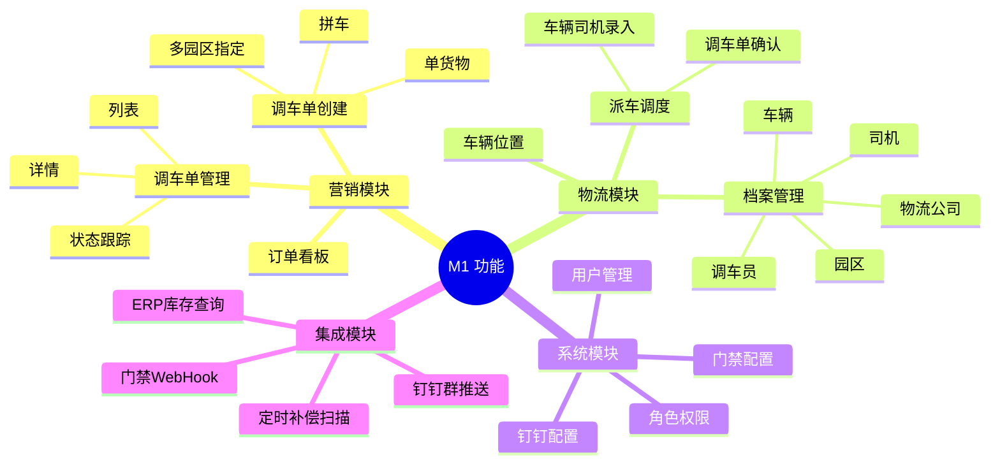
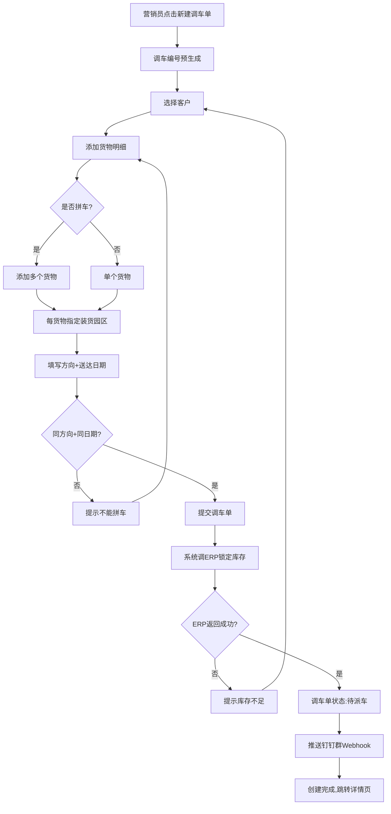
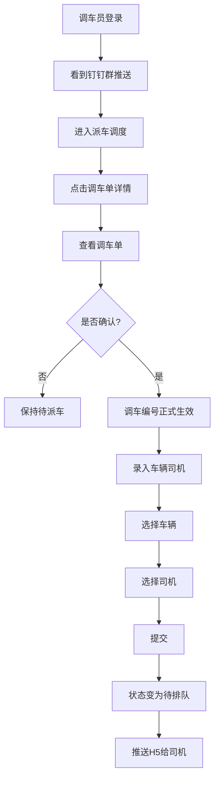
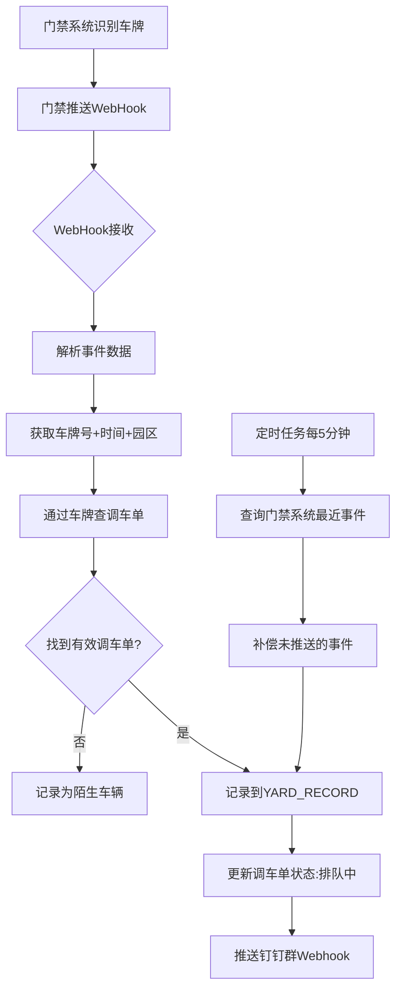
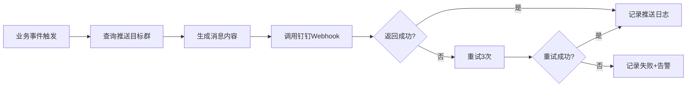

# 华翔物流管理系统 M1 阶段 PRD

> **版本**：v0.1（初稿）
> **编写日期**：2026-06-22
> **产品类型**：B 端 SaaS
> **本期范围**：Web 端（营销下单 + 物流派车 + 门禁基础对接）
> **依赖基础**：钉钉群机器人 Webhook、ERP 库存接口、门禁系统 Webhook 推送

---

## 1. 产品概述

### 1.1 产品信息

| 项目 | 内容 |
|------|------|
| 产品名称 | 华翔物流管理系统 |
| 项目代号 | hx-logistics-system |
| 适用企业 | 华翔集团（中型制造企业） |
| 使用终端 | Web 端（PC）+ 移动端 H5（司机，M1 仅做基础） |
| 本期版本 | M1（v0.1.0） |
| 编写依据 | V8 业务蓝图（2026-06-22 沟通确认） |

### 1.2 需求背景

华翔集团当前的物流调度依赖**人工 + 钉钉群**，存在以下核心问题：

| 痛点 | 现状 | 影响 |
|------|------|------|
| 调车单线下流转 | Excel/纸质单据，无统一系统 | 状态无法实时跟踪，易丢失 |
| 拼车靠人工记忆 | 营销员口述给调车员 | 错装/漏装风险高 |
| 门禁出入手工记录 | 保安手写登记本 | 效率低、易出错、无法查询 |
| 多园区协调难 | 跨园区无统一视图 | 信息孤岛 |
| 档案分散 | 车辆/司机/物流公司在各业务部门 | 数据不一致 |
| 调车编号规则乱 | 各部门自行编号 | 对账困难 |

### 1.3 本期产品目标

**核心目标**：打通「营销下单 → 物流派车 → 门禁入园」核心链路

| 维度 | 目标 | 衡量指标 |
|------|------|---------|
| 业务线上化 | 调车单 100% 系统化流转 | 线下纸质单占比从 80% 降至 0% |
| 拼车标准化 | 拼车场景系统自动校验 | 错装率从 5% 降至 0.1% |
| 门禁自动化 | 入园时间自动采集 | 保安手工登记减少 100% |
| 档案统一管理 | 车辆/司机/物流公司统一台账 | 档案完整率 ≥ 99% |
| 实时调度 | 订单状态实时可查 | 状态更新延迟 ≤ 5 秒 |

### 1.4 本期菜单清单总览

| 一级菜单 | 二级菜单 | 优先级 | 用户角色 |
|---------|---------|--------|---------|
| 营销管理 | 调车单管理 | **P0** | 营销业务员 |
| 营销管理 | 调车单创建 | **P0** | 营销业务员 |
| 营销管理 | 订单看板 | P1 | 营销业务员 |
| 物流管理 | 派车调度 | **P0** | 物流公司调车员 |
| 物流管理 | 调车单详情 | **P0** | 营销业务员 + 调车员 |
| 物流管理 | 物流公司档案 | **P0** | 系统管理员 |
| 物流管理 | 车辆档案 | **P0** | 系统管理员 |
| 物流管理 | 司机档案 | **P0** | 系统管理员 |
| 物流管理 | 调车员管理 | **P0** | 物流公司管理员 |
| 物流管理 | 园区档案 | **P0** | 系统管理员 |
| 物流管理 | 车辆位置 | P1 | 营销业务员 + 调车员 |
| 系统管理 | 用户管理 | **P0** | 系统管理员 |
| 系统管理 | 角色权限 | **P0** | 系统管理员 |
| 系统管理 | 钉钉配置 | **P0** | 系统管理员 |
| 系统管理 | 门禁配置 | **P0** | 系统管理员 |

### 1.5 名词定义

| 术语 | 解释 |
|------|------|
| **调车单** | 一次发货任务的核心单据，包含货物、客户、方向、园区信息 |
| **调车编号** | 调车单唯一标识，规则：年月日+4位流水（如 DC202606220001）|
| **预生成编号** | 营销员创建时系统自动生成的编号，状态为"待派车" |
| **正式编号** | 调车员确认录入后，预生成编号转为正式生效状态 |
| **拼车** | 同一辆车装多个客户货物（同方向+同时间）|
| **多园区** | 一辆车到多个园区分别装货（华翔共 2 个园区）|
| **物流公司** | 外部承运商，通过系统共用账号使用派车模块 |
| **调车员** | 物流公司内负责派车的工作人员 |
| **门禁系统** | 园区出入口的车牌识别系统，本期通过 WebHook 对接 |
| **钉钉群机器人** | 钉钉群内置的消息推送机器人（单向）|
| **WebHook** | 门禁系统主动推送事件到本系统的 HTTP 接口 |
| **WebSocket** | 本系统主动推送给前端的实时通道（用于门禁事件通知司机 H5）|

### 1.6 范围边界说明

**M1 包含**：
- ✅ 调车单创建（含拼车、多园区）
- ✅ 物流派车（调车员确认、车辆司机录入）
- ✅ 物流公司/车辆/司机/调车员/园区档案管理
- ✅ 门禁入园时间自动采集
- ✅ 钉钉群推送（营销→物流公司、司机入园→工厂群）
- ✅ 车辆位置列表（不接地图）
- ✅ 用户/角色/权限体系

**M1 不包含**（已规划到 M2/M3）：
- ❌ 门禁入场/出场时间（M2）
- ❌ 门禁拍照存档（M2）
- ❌ 钉钉工作通知（M2）
- ❌ 成品库人员管理（M2）
- ❌ ±500KG 过磅预警（M2）
- ❌ GPS 完整监控+轨迹回放（M2）
- ❌ 道闸系统对接（M3）
- ❌ 消息中心、报表看板（M3）
- ❌ 司机 H5 详细页面（M1 仅做基础，M2+完善）

---

## 2. 修订记录

| 日期 | 版本 | 修订内容 | 修订人 |
|------|------|---------|--------|
| 2026-06-22 | v0.1 | 初版，基于 V8 业务蓝图生成 | - |

---

## 3. 用户分析

### 3.1 用户角色

| 角色 | 归属 | 登录终端 | 核心职责 | M1 默认权限 |
|------|------|---------|---------|------------|
| **营销业务员** | 华翔内部 | Web | 调货需求创建、拼车、调车单管理 | 调车单全部 |
| **物流公司管理员** | 外部（物流公司） | Web | 管理本公司调车员账号 | 本公司调车员 |
| **物流公司调车员** | 外部（物流公司） | Web | 接单确认、录入车辆司机 | 本公司调车单 |
| **系统管理员** | 华翔内部 | Web | 账号、档案、配置管理 | 全部 |
| **华翔管理员** | 华翔内部 | Web | 创建物流公司根账号 | 物流公司管理 |

**M1 预留但不开发功能**：成品库人员角色（数据模型支持，无业务页面）

### 3.2 用户旅程

#### 营销业务员典型一天

```
08:00  登录系统
08:30  接到客户 A 的调货需求
       → 创建调车单（指定园区、调车编号预生成）
       → 客户 B 同方向同时间 → 拼车到同一调车单
       → 提交至物流公司
09:00  查看订单看板，跟踪调车单状态
10:00  收到推送：调车员已确认派车
       → 查看车辆/司机信息
14:00  收到推送：司机已到厂入园
       → 在订单看板看到状态变为"排队中"
16:00  客户催货 → 查看车辆 GPS 位置，确认在途
```

#### 物流公司调车员典型一天

```
09:00  登录系统（看到钉钉群推送提醒）
09:05  打开派车调度，看到待处理调车单
       → 调车单 DC202606220001（拼车2货物2客户）
09:10  点击详情，确认调车单
       → 调车编号正式生效
09:15  录入车辆：苏A12345 / 重型厢式 / 司机张三 / 13800138000 / 载重 30吨
09:20  提交，流程结束
       → 系统状态变为"待排队"
       → 通知司机
```

#### 物流公司管理员典型场景

```
月初：
  1. 登录系统
  2. 创建新调车员账号
  3. 分配给本公司调车员
  4. 调车员登录后即可使用
```

### 3.3 需求痛点优先级

| 痛点 | 优先级 | M1 解决方案 |
|------|--------|------------|
| 调车单线下流转 | P0 | 系统全流程数字化 |
| 拼车靠人工记忆 | P0 | 拼车校验+同一调车单挂多货物 |
| 多园区协调难 | P0 | 多园区独立记录+指定装货园区 |
| 门禁手工登记 | P0 | 门禁 WebHook 自动采集入园时间 |
| 档案分散 | P0 | 统一档案管理模块 |
| 调车编号规则乱 | P0 | 系统自动生成年月日+流水号 |
| 状态不可见 | P1 | 订单看板实时显示 |
| GPS 不可见 | P1 | 车辆位置列表（M1）/ 地图（M2）|

---

## 4. 需求详述

### 4.1 功能总览



### 4.2 页面交互流程

#### 4.2.1 调车单创建流程

```
营销管理 / 调车单管理
    │
    ├── [新建调车单] → 调车单创建页
    │       │
    │       ├── 选择货物（单/多）
    │       ├── 填写货物明细
    │       ├── 指定装货园区（每货物）
    │       ├── 拼车校验（同方向+同时间）
    │       │
    │       └── [提交] → 调车单详情页
    │                       │
    │                       └── 自动调 ERP 锁定库存
    │                       └── 自动推送钉钉群（Webhook）
    │
    └── [调车单号] → 调车单详情页
            │
            ├── 状态跟踪（时间线）
            ├── 货物明细
            ├── 调车员录入信息
            ├── 门禁入园记录
            └── GPS 位置（最新）
```

#### 4.2.2 派车调度流程

```
物流管理 / 派车调度
    │
    ├── 调车单列表（待派车）
    │       │
    │       └── [调车单号] → 调车单详情页
    │               │
    │               ├── 查看调车单详情
    │               ├── [确认调车单] → 状态:待排队
    │               │
    │               └── [录入车辆司机] → 表单
    │                       │
    │                       ├── 选择车辆（关联本公司）
    │                       ├── 选择司机（关联本公司）
    │                       │
    │                       └── [提交] → 调车单状态:待排队
    │                                       └── 自动推送司机（H5 系统内）
    │
    └── 已处理调车单（待排队/排队中）
```

#### 4.2.3 档案管理流程

```
系统管理 / 物流公司
    │
    ├── 列表（搜索+筛选）
    │       │
    │       └── [公司名] → 详情
    │               ├── 基本信息
    │               ├── 调车员列表
    │               ├── 车辆列表
    │               └── 司机列表
    │
    └── [新建物流公司] → 表单
            ├── 基本信息
            └── 提交 → 创建根账号

类似的：车辆档案、司机档案、调车员管理、园区档案
```

### 4.3 模块详细说明

#### 模块 1：调车单管理（P0）

**功能描述**：调车单的全生命周期管理，是 M1 的核心模块。

**字段说明（调车单创建）**：

| 字段名 | 类型 | 必填 | 说明 | 详细解释 |
|--------|------|------|------|---------|
| 客户 | 单选 | ✓ | 客户名称 | 从客户档案选择，M1 客户档案硬编码（无客户管理模块）|
| 货物 | 多选 | ✓ | 货物明细 | 支持 1-N 个货物明细（拼车）|
| 货物-产品名称 | 文本 | ✓ | 产品名 | 例：成品-A 型 |
| 货物-数量 | 数字 | ✓ | 数量 | 支持小数点后 2 位 |
| 货物-单位 | 单选 | ✓ | 吨/件/箱 | 默认吨 |
| 货物-装货园区 | 单选 | ✓ | 园区 | 从园区档案选择 |
| 方向 | 文本 | ✓ | 发往地 | 例：上海/江苏 |
| 送达日期 | 日期 | ✓ | 要求送达 | 未来日期 |
| 备注 | 文本 | - | 其他说明 | 选填，500 字内 |

**字段说明（调车单详情）**：

| 字段名 | 类型 | 说明 |
|--------|------|------|
| 调车编号 | 文本 | 预生成/正式 |
| 状态 | 单选 | 待派车/待排队/排队中/已通知入场/已入场/装货中/已出场/已完成/已取消 |
| 创建人 | 文本 | 营销业务员姓名 |
| 创建时间 | 日期 | 自动 |
| 确认时间 | 日期 | 调车员确认时间（M1 才有）|
| 派车时间 | 日期 | 调车员录入完成时间 |
| 入园时间 | 日期 | 门禁系统记录（M1）|
| 车辆信息 | 关联 | 车牌号/车型/载重 |
| 司机信息 | 关联 | 姓名/电话 |
| 当前位置 | 文本 | 最新 GPS 位置（经纬度）|
| 门禁记录 | 列表 | 该调车单的所有园区门禁记录 |

**调车编号生成规则**：
- 格式：`DC + YYYYMMDD + 4位流水`
- 示例：`DC202606220001`
- 生成时机：营销员点击"新建调车单"时预生成
- 流水号：当天的递增序号，从 0001 开始

**拼车校验规则**：
- 条件：**同方向 + 同送达日期**（同时间）
- 不满足时禁止提交，提示"不同方向/不同日期不能拼车"

**多园区规则**：
- 同一调车单可以挂多个货物
- 每个货物可以指定不同的装货园区
- M1 仅记录入园时间，M2 才会记录入场/出场

**状态机**：
```
[待派车(预生成)] 
    -- 调车员确认+录入 --> [待排队]
    -- 调车员拒绝/超时 --> [已取消]
[待排队] 
    -- 门禁入园(车辆) --> [排队中]
[排队中] 
    -- M2 --> [已通知入场] → [已入场] → [装货中] → [已出场]
    -- M1 暂止于此 --> 等待 M2
```

---

#### 模块 2：派车调度（P0）

**功能描述**：物流公司调车员处理"待派车"调车单。

**页面：派车调度列表**
- 显示**本公司**的待派车调车单
- 字段：调车编号/创建时间/客户/方向/货物数量/操作
- 筛选：状态（待派车/待排队/排队中）/ 时间范围

**页面：调车单详情（调车员视角）**
- 显示完整调车单信息
- 操作：
  1. **确认调车单**：调车编号预生成 → 正式生效
  2. **录入车辆司机**：进入录入表单

**字段说明（车辆司机录入）**：

| 字段名 | 类型 | 必填 | 说明 | 详细解释 |
|--------|------|------|------|---------|
| 车牌号 | 单选 | ✓ | 关联车辆 | 从本公司车辆档案选择 |
| 车型 | 文本 | - | 自动填充 | 选中车辆后自动带出 |
| 载重 | 数字 | - | 自动填充 | 选中车辆后自动带出 |
| 司机姓名 | 单选 | ✓ | 关联司机 | 从本公司司机档案选择 |
| 司机电话 | 文本 | - | 自动填充 | 选中司机后自动带出 |
| 预计到达时间 | 日期 | - | 预计时间 | 选填 |

**提交后行为**：
- 调车单状态变为"待排队"
- 系统自动通过 H5 推送通知司机
- 调车员可在列表看到该调车单已处理

---

#### 模块 3：物流公司档案（P0）

**功能描述**：管理合作的物流公司基础信息。

**字段说明**：

| 字段名 | 类型 | 必填 | 说明 | 详细解释 |
|--------|------|------|------|---------|
| 公司名称 | 文本 | ✓ | 全称 | 不可重复 |
| 联系人 | 文本 | ✓ | 业务联系人姓名 | |
| 联系电话 | 文本 | ✓ | 手机号 | 11 位手机号 |
| 钉钉群 Webhook | 文本 | - | 推送地址 | 由物流公司提供 |
| 营业执照号 | 文本 | - | 统一社会信用代码 | 18 位 |
| 合作状态 | 单选 | ✓ | 合作中/暂停 | 默认合作中 |
| 备注 | 文本 | - | 其他说明 | 500 字内 |

**操作**：
- 新建、编辑、查看详情、启停
- 详情页包含：基本信息、调车员列表（关联）、车辆列表（关联）、司机列表（关联）

---

#### 模块 4：车辆档案（P0）

**字段说明**：

| 字段名 | 类型 | 必填 | 说明 | 详细解释 |
|--------|------|------|------|---------|
| 车牌号 | 文本 | ✓ | 车牌 | 例：苏A12345，系统内唯一 |
| 车型 | 单选 | ✓ | 车型 | 重型厢式/重型平板/中型厢式/轻型厢式 |
| 载重(吨) | 数字 | ✓ | 最大载重 | 支持小数点后 1 位 |
| 所属物流公司 | 单选 | ✓ | 关联公司 | 从物流公司档案选择 |
| 环保等级 | 单选 | - | 国五/国六/电车 | 选填 |
| 状态 | 单选 | ✓ | 正常/维修/停用 | 默认正常 |
| 备注 | 文本 | - | 其他 | |

---

#### 模块 5：司机档案（P0）

**字段说明**：

| 字段名 | 类型 | 必填 | 说明 | 详细解释 |
|--------|------|------|------|---------|
| 姓名 | 文本 | ✓ | 真实姓名 | |
| 手机号 | 文本 | ✓ | 联系手机 | 11 位，系统内唯一（用于 H5 登录）|
| 身份证号 | 文本 | - | 身份证 | 18 位，敏感字段需脱敏展示 |
| 驾驶证号 | 文本 | - | 驾驶证编号 | |
| 所属物流公司 | 单选 | ✓ | 关联公司 | |
| 状态 | 单选 | ✓ | 在岗/休假 | 默认在岗 |
| 备注 | 文本 | - | 其他 | |

**敏感字段处理**：身份证号、驾驶证号列表脱敏（中间几位打码）

---

#### 模块 6：调车员管理（P0）

**功能描述**：物流公司管理员管理本公司调车员账号。

**字段说明**：

| 字段名 | 类型 | 必填 | 说明 | 详细解释 |
|--------|------|------|------|---------|
| 登录账号 | 文本 | ✓ | 系统账号 | 工号/手机号 |
| 姓名 | 文本 | ✓ | 真实姓名 | |
| 手机号 | 文本 | ✓ | 联系手机 | 11 位 |
| 所属物流公司 | 自动 | ✓ | 创建者所属 | 不可修改 |
| 角色 | 单选 | ✓ | 调车员/本公司管理员 | |
| 状态 | 单选 | ✓ | 启用/禁用 | |
| 初始密码 | 文本 | ✓ | 系统生成 | 6 位随机，首次登录强制修改 |

**账号层级**：
```
华翔系统管理员
  └── 创建物流公司 → 自动生成"物流公司根管理员"账号
       └── 物流公司根管理员登录
            └── 创建本公司调车员
            └── 创建本公司管理员
```

---

#### 模块 7：园区档案（P0）

**字段说明**：

| 字段名 | 类型 | 必填 | 说明 | 详细解释 |
|--------|------|------|------|---------|
| 园区编码 | 文本 | ✓ | 唯一标识 | 例：YARD_A |
| 园区名称 | 文本 | ✓ | 全称 | 例：华翔园区 A |
| 地址 | 文本 | ✓ | 详细地址 | |
| 钉钉群 Webhook | 文本 | - | 该园区的工厂钉钉群 | 司机入园时推送的目标 |
| 门禁系统 ID | 文本 | - | 门禁系统中的园区 ID | 用于门禁 WebHook 关联 |
| 门禁 WebHook 地址 | 文本 | - | 该园区的门禁接收地址 | 例：https://hx-logistics.com/api/gate/YARD_A |
| 状态 | 单选 | ✓ | 启用/停用 | |

**重要**：园区编码必须与门禁系统中的园区标识一致，否则门禁事件无法关联。

---

#### 模块 8：车辆位置列表（P1）

**功能描述**：显示所有在途车辆的实时位置。

**字段说明**：

| 列 | 说明 |
|----|------|
| 调车编号 | 关联 |
| 车牌号 | 关联 |
| 司机 | 关联 |
| 当前位置 | 经纬度（点击查看地图：M2）|
| 最后上报时间 | 时间 |
| 状态 | 在途/入园/已出场/已送达 |

**数据来源**：H5 上报的 DRIVER_LOCATION 表

**M1 限制**：
- 仅显示最新位置（无地图）
- 无轨迹回放
- 无聚合显示

---

#### 模块 9：用户管理 / 角色权限（P0）

**用户管理**：
- 列表：所有系统用户
- 字段：账号/姓名/手机号/角色/状态/创建时间
- 操作：新建/编辑/启停/重置密码

**角色管理**：
- 内置角色：系统管理员、华翔管理员、营销业务员、物流公司管理员、调车员
- M1 不开放自定义角色（后续版本支持）

**权限矩阵**：

| 功能 | 系统管理员 | 华翔管理员 | 营销业务员 | 物流公司管理员 | 调车员 |
|------|-----------|-----------|-----------|--------------|--------|
| 调车单管理 | 全部 | 全部 | ✓（默认） | 仅本公司 | 仅本公司 |
| 调车单创建 | - | - | ✓（默认） | - | - |
| 派车调度 | - | - | 仅查看 | ✓（默认） | ✓（默认） |
| 物流公司档案 | ✓ | ✓ | 仅查看 | 仅本公司 | - |
| 车辆档案 | ✓ | ✓ | 仅查看 | 本公司 | 本公司 |
| 司机档案 | ✓ | ✓ | 仅查看 | 本公司 | 本公司 |
| 调车员管理 | - | 创建根管理员 | - | ✓（默认） | - |
| 园区档案 | ✓ | ✓ | 仅查看 | - | - |
| 车辆位置 | 全部 | 全部 | 全部 | 全部 | 全部 |
| 用户管理 | ✓ | - | - | 本公司 | - |
| 钉钉配置 | ✓ | ✓ | - | - | - |
| 门禁配置 | ✓ | ✓ | - | - | - |

**说明**：
- "全部"=无限制
- "✓（默认）"=默认开放，可配置
- 仅查看/本公司/仅本公司 = 有数据范围限制

---

#### 模块 10：钉钉配置（P0）

**功能**：配置每个物流公司、每个园区的钉钉群 Webhook。

**配置项**：
- 物流公司列表（带 Webhook）
- 园区列表（带 Webhook）
- 测试推送功能（发送一条测试消息）
- 推送日志（最近 100 条）

---

#### 模块 11：门禁配置（P0）

**功能**：配置门禁系统对接。

**配置项**：
- 全局开关：是否启用门禁对接
- 定时补偿：扫描间隔（默认 5 分钟）
- 门禁日志：最近 100 条接收记录
- 手动重推：补推某条门禁事件

---

### 4.4 业务流程图

#### 4.4.1 调车单创建流程



#### 4.4.2 派车调度流程



#### 4.4.3 门禁对接流程（M1）



#### 4.4.4 钉钉群推送流程



---

### 4.5 边界场景

| 场景 | 页面表现 | 用户提示 | 处理逻辑 |
|------|---------|---------|---------|
| 调车单列表为空 | 空状态插画 | "暂无调车单，点击新建按钮创建" | 显示新建按钮 |
| 调车单详情不存在 | 404 页面 | "调车单不存在或已删除" | 返回列表 |
| 拼车时不同方向 | 提交按钮置灰 | "不同方向/不同日期不能拼车" | 前端校验 |
| ERP 库存不足 | Toast 错误提示 | "客户A的XX产品库存不足" | 提示后回到表单 |
| 钉钉推送失败 | 系统内消息提示管理员 | "钉钉推送失败，请检查 Webhook 配置" | 后端重试3次+告警 |
| 门禁推送失败 | 门禁日志显示失败 | "门禁事件接收失败" | 定时补偿扫描会重试 |
| 陌生车辆入园 | 门禁日志记录 | "车辆XXX无关联调车单" | 管理员手动处理 |
| 调车员无车辆可选 | 下拉为空 | "本公司暂无车辆，请先在车辆档案添加" | 引导到车辆档案 |
| 调车员无司机可选 | 下拉为空 | "本公司暂无司机，请先在司机档案添加" | 引导到司机档案 |
| 调车单被取消 | 状态变已取消 | - | 仅"待派车"状态可取消 |
| 调车员账号禁用 | 登录提示 | "账号已禁用，请联系管理员" | 阻止登录 |
| 客户档案未配置 | 客户下拉为空 | "请先联系管理员配置客户档案" | M1 客户档案为硬编码枚举 |
| 网络加载失败 | 错误占位图 | "加载失败，点击重试" | 重试按钮 |
| 操作频率限制 | 按钮置灰 | "操作过于频繁，请稍候" | 倒计时恢复 |
| 导出数据量大 | 进度条 | "正在导出，请稍候" | 完成后下载 |

---

### 4.6 数据字典（关键字段）

#### 4.6.1 调车单表（DISPATCH）

| 字段 | 类型 | 必填 | 说明 |
|------|------|------|------|
| id | string | ✓ | 主键，调车编号 DC202606220001 |
| status | enum | ✓ | 见状态机 |
| is_pre | boolean | ✓ | true=预生成 / false=正式 |
| customer_name | string | ✓ | 客户名（M1 硬编码）|
| direction | string | ✓ | 方向 |
| required_date | date | ✓ | 送达日期 |
| company_id | string | ✓ | 派给的物流公司ID |
| vehicle_id | string | - | 调车员录入后填充 |
| driver_id | string | - | 调车员录入后填充 |
| created_by | string | ✓ | 创建人 ID |
| created_at | datetime | ✓ | 创建时间 |
| confirmed_at | datetime | - | 调车员确认时间 |
| dispatched_at | datetime | - | 派车时间 |
| queue_at | datetime | - | 入园时间（门禁）|
| remark | text | - | 备注 |

#### 4.6.2 调车单货物明细（DISPATCH_GOODS）

| 字段 | 类型 | 必填 | 说明 |
|------|------|------|------|
| id | string | ✓ | 主键 |
| dispatch_id | string | ✓ | 关联调车单 |
| product_name | string | ✓ | 产品名 |
| product_code | string | - | 产品编码 |
| quantity | decimal | ✓ | 数量 |
| unit | string | ✓ | 单位 |
| yard_id | string | ✓ | 装货园区 |
| required_date | date | ✓ | 送达日期 |
| remark | text | - | 备注 |

#### 4.6.3 物流公司（LOGISTICS_COMPANY）

| 字段 | 类型 | 必填 | 说明 |
|------|------|------|------|
| id | string | ✓ | 主键 |
| name | string | ✓ | 公司名称，唯一 |
| contact | string | ✓ | 联系人 |
| phone | string | ✓ | 联系电话 |
| dingtalk_webhook | string | - | 钉钉群 Webhook |
| business_license | string | - | 营业执照号 |
| status | enum | ✓ | 合作中/暂停 |
| created_at | datetime | ✓ | 创建时间 |

#### 4.6.4 车辆（VEHICLE）

| 字段 | 类型 | 必填 | 说明 |
|------|------|------|------|
| id | string | ✓ | 主键 |
| plate_number | string | ✓ | 车牌号，唯一 |
| vehicle_type | enum | ✓ | 重型厢式/重型平板/中型厢式/轻型厢式 |
| load_capacity | decimal | ✓ | 载重（吨）|
| company_id | string | ✓ | 所属物流公司 |
| env_level | enum | - | 国五/国六/电车 |
| status | enum | ✓ | 正常/维修/停用 |
| created_at | datetime | ✓ | 创建时间 |

#### 4.6.5 司机（DRIVER）

| 字段 | 类型 | 必填 | 说明 |
|------|------|------|------|
| id | string | ✓ | 主键 |
| name | string | ✓ | 姓名 |
| phone | string | ✓ | 手机号，唯一 |
| id_card | string | - | 身份证号（脱敏）|
| license_no | string | - | 驾驶证号 |
| company_id | string | ✓ | 所属物流公司 |
| status | enum | ✓ | 在岗/休假 |

#### 4.6.6 调车员（DISPATCHER）

| 字段 | 类型 | 必填 | 说明 |
|------|------|------|------|
| id | string | ✓ | 主键 |
| user_id | string | ✓ | 关联用户ID |
| name | string | ✓ | 姓名 |
| phone | string | ✓ | 手机号 |
| company_id | string | ✓ | 所属物流公司 |
| role | enum | ✓ | 调车员/本公司管理员 |
| status | enum | ✓ | 启用/禁用 |

#### 4.6.7 园区（YARD）

| 字段 | 类型 | 必填 | 说明 |
|------|------|------|------|
| id | string | ✓ | 主键，编码 YARD_A |
| name | string | ✓ | 园区名称 |
| address | string | ✓ | 地址 |
| dingtalk_webhook | string | - | 工厂钉钉群 |
| access_system_id | string | - | 门禁系统中的园区 ID |
| gate_webhook_token | string | - | 门禁 Webhook 鉴权 token |
| status | enum | ✓ | 启用/停用 |

#### 4.6.8 门禁记录（YARD_RECORD）

| 字段 | 类型 | 必填 | 说明 |
|------|------|------|------|
| id | string | ✓ | 主键 |
| dispatch_id | string | ✓ | 关联调车单 |
| yard_id | string | ✓ | 关联园区 |
| plate_number | string | ✓ | 车牌号 |
| queue_time | datetime | ✓ | 入园时间（M1）|
| entry_time | datetime | - | 入场时间（M2）|
| exit_time | datetime | - | 出场时间（M2）|
| source | enum | ✓ | webhook/补偿 |
| raw_data | json | - | 门禁原始数据 |

#### 4.6.9 司机位置（DRIVER_LOCATION）

| 字段 | 类型 | 必填 | 说明 |
|------|------|------|------|
| id | string | ✓ | 主键 |
| dispatch_id | string | ✓ | 关联调车单 |
| driver_id | string | ✓ | 司机 ID |
| latitude | decimal | ✓ | 纬度 |
| longitude | decimal | ✓ | 经度 |
| reported_at | datetime | ✓ | 上报时间 |

#### 4.6.10 钉钉推送日志（DINGTALK_LOG）

| 字段 | 类型 | 必填 | 说明 |
|------|------|------|------|
| id | string | ✓ | 主键 |
| event_type | enum | ✓ | 推送1/推送2/推送3/推送4 |
| target | string | ✓ | 推送目标（群名）|
| webhook_url | string | ✓ | 实际推送 URL |
| content | text | ✓ | 推送内容 |
| status | enum | ✓ | 成功/失败/重试中 |
| response | text | - | 钉钉返回 |
| retry_count | int | ✓ | 重试次数 |
| created_at | datetime | ✓ | 创建时间 |

#### 4.6.11 门禁接收日志（GATE_LOG）

| 字段 | 类型 | 必填 | 说明 |
|------|------|------|------|
| id | string | ✓ | 主键 |
| yard_id | string | ✓ | 园区 |
| event_type | enum | ✓ | 入园/入场/出场 |
| plate_number | string | ✓ | 车牌 |
| event_time | datetime | ✓ | 事件时间 |
| raw_data | json | ✓ | 原始数据 |
| process_status | enum | ✓ | 已处理/待处理/失败 |
| created_at | datetime | ✓ | 接收时间 |

---

### 4.7 钉钉消息模板

#### 模板 1：营销 → 物流公司群

**触发时机**：营销员提交调车单

**模板**：
```
【新调车任务】

调车编号：{dispatch_id}
方向：{direction}
送达日期：{required_date}

货物明细：
{goods_list}

共 {yard_count} 个装货园区

请及时安排车辆司机，谢谢！
```

**变量说明**：
- `dispatch_id`：调车编号
- `direction`：方向
- `required_date`：送达日期
- `goods_list`：货物明细列表（每行：`客户XX·产品YY·数量ZZ`）
- `yard_count`：装货园区数量

---

#### 模板 2：司机入园 → 工厂群

**触发时机**：门禁系统识别车辆入园

**模板**：
```
【已排队车辆】

调车编号：{dispatch_id}
园区：{yard_name}
车牌号：{plate_number}
入园时间：{queue_time}

请安排入场，谢谢！
```

**变量说明**：
- `dispatch_id`：调车编号
- `yard_name`：园区名称
- `plate_number`：车牌号
- `queue_time`：入园时间

---

### 4.8 关键接口清单

| 接口 | 方法 | 路径 | 说明 |
|------|------|------|------|
| 调车单列表 | GET | /api/dispatch | 支持分页/筛选 |
| 调车单详情 | GET | /api/dispatch/:id | |
| 创建调车单 | POST | /api/dispatch | |
| 调车员确认 | POST | /api/dispatch/:id/confirm | |
| 录入车辆司机 | POST | /api/dispatch/:id/assign | |
| 取消调车单 | POST | /api/dispatch/:id/cancel | |
| 物流公司列表 | GET | /api/logistics-company | |
| 物流公司详情 | GET | /api/logistics-company/:id | |
| 创建物流公司 | POST | /api/logistics-company | |
| 车辆列表 | GET | /api/vehicle | 支持按公司筛选 |
| 创建车辆 | POST | /api/vehicle | |
| 司机列表 | GET | /api/driver | 支持按公司筛选 |
| 创建司机 | POST | /api/driver | |
| 调车员列表 | GET | /api/dispatcher | |
| 创建调车员 | POST | /api/dispatcher | |
| 园区列表 | GET | /api/yard | |
| 创建园区 | POST | /api/yard | |
| 门禁 WebHook 接收 | POST | /api/gate/:yardId | |
| 钉钉测试推送 | POST | /api/dingtalk/test | |
| 车辆位置列表 | GET | /api/vehicle-location | |
| WebSocket 连接 | WS | /socket.io | 实时推送 |

---

### 4.9 工时评估

| 功能点 | 工时(人天) | 技术风险 | 第三方依赖 | 改造成本 |
|--------|------------|----------|------------|---------|
| 项目脚手架搭建 | 1 | 低 | 无 | 低 |
| 调车单创建（拼车+多园区） | 3 | 中 | 无 | 中 |
| 调车单列表+详情 | 2 | 低 | 无 | 低 |
| 派车调度（确认+录入） | 2 | 低 | 无 | 低 |
| 物流公司档案 | 1.5 | 低 | 无 | 低 |
| 车辆档案 | 1 | 低 | 无 | 低 |
| 司机档案 | 1 | 低 | 无 | 低 |
| 调车员管理 | 2 | 中 | 无 | 中 |
| 园区档案 | 1.5 | 低 | 无 | 低 |
| 车辆位置列表 | 1.5 | 中 | 地图（M2再接）| 中 |
| 用户管理 | 1.5 | 低 | 无 | 低 |
| 角色权限 | 2 | 中 | 无 | 中 |
| 钉钉配置 | 1.5 | 中 | 钉钉开放平台 | 中 |
| 门禁 WebHook 接收 | 2 | 高 | 门禁系统 | 高 |
| 定时补偿扫描 | 1.5 | 中 | 无 | 中 |
| ERP 库存对接 | 2 | 高 | ERP 系统 | 高 |
| WebSocket 实时推送 | 1.5 | 中 | Socket.IO | 中 |
| 数据库设计+迁移 | 1 | 低 | 无 | 低 |
| 部署+测试 | 2 | 低 | 无 | 低 |
| **合计** | **32.5** | | | |

**说明**：
- 按 1 个全栈开发人员计算
- 实际开发可能 2 人协作，可压缩到 4-5 周
- 高风险项：门禁 WebHook（依赖门禁系统稳定性）、ERP 对接（依赖 ERP 厂商）

---

## 5. 非功能需求

### 5.1 性能需求

| 指标 | 要求 |
|------|------|
| 页面首次加载 | ≤ 2 秒（4G 网络）|
| 列表查询响应 | ≤ 1 秒（万级数据）|
| 调车单详情响应 | ≤ 500ms |
| 钉钉推送延迟 | ≤ 3 秒（业务事件触发后）|
| 门禁 WebHook 处理 | ≤ 1 秒（接收→入库）|
| WebSocket 推送延迟 | ≤ 2 秒 |
| 并发用户 | ≥ 50 同时在线 |
| 调车单总量 | 支持 ≥ 10 万条历史数据 |

### 5.2 安全需求

| 项 | 要求 |
|----|------|
| 登录认证 | JWT Token，30 天过期 |
| 密码存储 | bcrypt 加密，禁止明文 |
| 敏感字段 | 身份证/驾驶证列表脱敏 |
| 操作日志 | 关键操作（创建/修改/删除）记录审计日志 |
| API 鉴权 | 所有接口需登录，除门禁 WebHook |
| WebHook 鉴权 | 门禁 WebHook 需 Token 验证 |
| 跨域 | 仅允许配置的域名 |
| XSS 防护 | Ant Design 默认 + 严格 CSP |
| SQL 注入 | 参数化查询，禁止拼接 SQL |
| 数据隔离 | 物流公司数据严格隔离（按 company_id 过滤）|

### 5.3 集成需求

| 系统 | 方式 | 用途 |
|------|------|------|
| ERP | REST API（待 ERP 厂商提供）| 库存查询+订单锁定 |
| 门禁系统 | WebHook 推送 | 入园时间采集 |
| 钉钉 | 群机器人 Webhook | 消息推送 |
| 短信网关 | HTTP API（可选）| 验证码/告警 |

### 5.4 数据导入导出

| 项 | 说明 |
|----|------|
| 调车单导出 | 支持 Excel 导出（按筛选条件）|
| 调车单导入 | M1 不支持批量导入（手动创建）|
| 车辆批量导入 | 支持 Excel 导入（M1 后期）|
| 司机批量导入 | 支持 Excel 导入（M1 后期）|

---

## 6. 项目排期

### 6.1 版本规划

| 版本 | 前置依赖 | 模块 | 功能范围 | 预计周期 |
|------|----------|------|----------|----------|
| **M1** | 无 | 营销下单 + 物流派车 + 门禁基础对接 + 钉钉推送 | 32.5 人天 | 6 周 |
| M2 | M1 | 成品库管理 + 过磅预警 + 门禁完整对接 + GPS监控 | 预估 35 人天 | 6 周 |
| M3 | M2 | 道闸对接 + 消息中心 + 报表看板 | 预估 20 人天 | 4 周 |

### 6.2 M1 里程碑

| 里程碑 | 时间 | 交付 |
|--------|------|------|
| M1-1 | 第 1 周末 | 项目脚手架 + 基础数据模型 + 用户/权限 |
| M1-2 | 第 2 周末 | 物流公司/车辆/司机/园区档案管理 |
| M1-3 | 第 3 周末 | 调车员账号体系 + 钉钉配置 |
| M1-4 | 第 4 周末 | 调车单创建（含拼车+多园区）|
| M1-5 | 第 5 周末 | 派车调度 + 门禁 WebHook + 钉钉推送 |
| M1-6 | 第 6 周末 | 联调测试 + 修复 + 部署上线 |

### 6.3 依赖关系

| 依赖项 | 提供方 | 时间要求 |
|--------|--------|---------|
| ERP 库存 API | ERP 厂商 | M1 启动前 |
| 门禁系统 WebHook 文档 | 门禁厂商 | M1 第 3 周前 |
| 各物流公司钉钉群 Webhook | 华翔IT | M1 第 4 周前 |
| 钉钉企业应用凭证 | 华翔IT | M2 启动前 |
| 服务器资源 | 运维 | M1 启动前 |
| 域名+SSL证书 | 运维 | M1 启动前 |

---

## 7. 附录

### 7.1 术语表

| 术语 | 解释 |
|------|------|
| 调车单 | 一次发货任务的核心单据 |
| 调车编号 | 调车单唯一标识，DC+年月日+流水 |
| 预生成 | 营销员创建时系统自动生成的编号 |
| 拼车 | 同一辆车装多个客户货物 |
| 多园区 | 一辆车到多个园区分别装货 |
| 物流公司 | 外部承运商 |
| 调车员 | 物流公司内负责派车的工作人员 |
| 门禁系统 | 园区出入口的车牌识别系统 |
| WebHook | HTTP 回调接口 |
| WebSocket | 全双工通信协议 |

### 7.2 FAQ

**Q1：M1 不做门禁拍照存档吗？**
A：M1 仅记录入园时间，不存照片。M2 会扩展到入场/出场时间和拍照存档。

**Q2：M1 车辆位置为什么不用地图？**
A：M1 优先级是快速看到车辆位置，列表展示足够。M2 会接入地图和轨迹回放。

**Q3：客户档案怎么管理？**
A：M1 客户档案为硬编码枚举（系统管理员后台配置），无独立客户管理模块。M2/M3 考虑独立模块。

**Q4：调车员可以看到其他公司的调车单吗？**
A：不可以。系统按 company_id 严格隔离数据。

**Q5：M1 司机 H5 有什么功能？**
A：M1 H5 仅做基础：登录、接收派车单、GPS 上报。详细交互后续优化。

**Q6：钉钉推送失败怎么办？**
A：系统自动重试 3 次（间隔 1/3/5 秒），失败后记录到日志并告警管理员。

**Q7：门禁 WebHook 漏推怎么办？**
A：定时任务每 5 分钟查询门禁系统最近事件，补偿未推送的事件。

**Q8：陌生车辆入园怎么处理？**
A：门禁日志记录"无关联调车单"，管理员手动处理（创建临时调车单或忽略）。

**Q9：拼车的最大货物数量？**
A：M1 不限制数量，但建议 ≤ 10 个货物明细。

**Q10：调车单可以修改吗？**
A：M1 仅"待派车"状态可编辑，其他状态不可修改（避免数据不一致）。

---

**文档结束**

> 本 PRD 文档基于 2026-06-22 业务沟通结果生成。
> 任何重大变更需要更新版本号和修订记录。
